# tomcat基础
1.1 web概念
软件架构：c/s，b/s
资源分类：静态资源：所有用户访问后得到的结果都是一样的，可以直接被浏览器解析，比如html,css,js,jpg等
动态资源：用户访问相同资源结果不一样
网络通信三要素：协议，主机，端口
web服务器软件：可以在这个软件中部署web项目，让用户通过浏览器访问，tomcat就是一个开源免费的web服务器软件
1.2 tomcat的文件结构
bin：可执行文件，存放各种脚本
conf：配置文件
lib：依赖
webapps：默认的web项目部署目录，我们写的web项目就放在这里
# tomcat架构
## http的工作原理
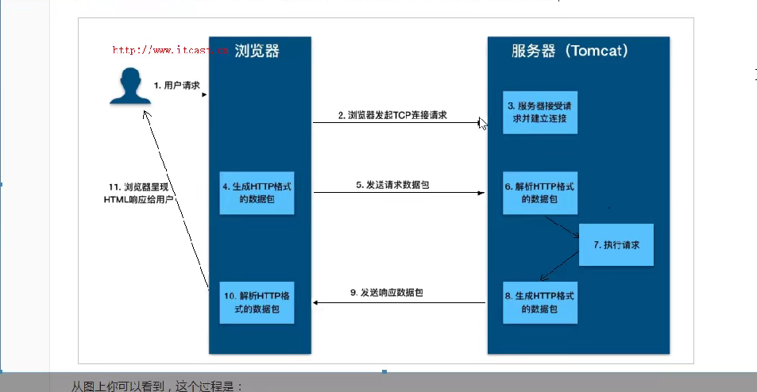
### tcp 三次握手

# TCP 三次握手
> 目标：**建立双向可靠连接**，客户端、服务端双方确认自己和对方的发送、接收能力都正常；协商初始序列号 ISN。
TCP是全双工，连接需要**客户端→服务端**、**服务端→客户端**两个方向都打通。

报文标记位重点：
- `SYN`：同步，用于初始化序列号；**SYN报文会消耗一个序列号**
- `ACK`：确认，ack号表示期望收到下一个字节的序号
- ISN：初始序列号，通信双方各自随机生成

---

## 三次握手完整过程
假定：客户端C，服务端S
1. **第一次握手：C → S 【SYN】**
   客户端主动发起连接，发送 `SYN=1`，客户端自己的初始序列号 `seq = ISN(c)`。
> 客户端状态：`SYN_SENT`
含义：我客户端要建连接，我的初始序号是ISN(c)。

2. **第二次握手：S → C 【SYN+ACK】**
   服务端收到SYN，回复报文：
   `SYN=1，ACK=1`
- ack = ISN(c) + 1 （确认客户端，期望下一次收到ISN(c)+1）
- seq = ISN(s) （服务端自己的初始序列号）
> 服务端状态：`SYN_RCVD`
含义：收到你的连接请求；我这边也准备好连接，我的初始序号ISN(s)。

3. **第三次握手：C → S 【ACK】**
   客户端收到SYN+ACK，回复确认报文：
   `ACK=1`，`ack = ISN(s)+1`；seq = ISN(c)+1
> 客户端状态变为 `ESTABLISHED`；服务端收到该ACK后，也变为`ESTABLISHED`。
含义：确认收到服务端的SYN，双向连接正式建立。

> ⚠️注意：**第三次握手的ACK报文可以携带业务数据；前两次SYN报文不能携带数据**。

---

## 为什么是3次，不是2次？（面试高频）
核心：**防止历史失效的旧连接报文导致服务器建立无效连接，浪费资源**
- 如果两次握手：只要客户端发SYN，服务器回复SYN+ACK，服务器就直接进入连接状态。
- 场景：网络延迟，一个很早的旧SYN迟到到达服务器。服务器回复SYN+ACK，直接建立连接。但客户端早就不需要这个连接，直接忽略报文。**服务器会一直等待，白白占用资源**。
- 三次握手：服务器收到旧SYN后，要等待客户端的第三次ACK。客户端不会回复这个ACK，服务器超时后释放连接，不会建立无效连接。

> 另一个角度：要确认双方收发能力：
1次：客户端只知道自己能发；
2次：客户端确认双向通，**但服务器只确认了客户端能发，不知道自己发的包客户端能不能收到**；
3次：双方都确认「我发的对方收得到，对方发的我收得到」。

---

## 状态流转小结
- 客户端：`CLOSED` → `SYN_SENT` →`ESTABLISHED`
- 服务端：`LISTEN` → `SYN_RCVD` →`ESTABLISHED`

## 易错考点
1. SYN报文消耗一个序号，所以ack是 ISN+1；
2. 第二次握手同时完成两件事：同步自己ISN + 确认对方；
3. 第三次ACK可以带数据；SYN不能带；
4. 两次握手的核心问题：服务端无法感知客户端是否收到自己的SYN，会建立过期无效连接。

## 对比记忆（顺带）
四次挥手：断开连接，因为TCP是全双工，**两边可以分别关闭读写**，所以要4次。

如果你需要，我可以给你整理：四次挥手、time_wait作用、syn洪水攻击极简面试版。
## 架构
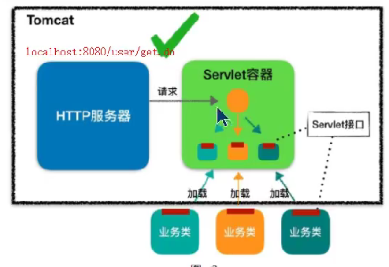
### servlet容器的工作流程
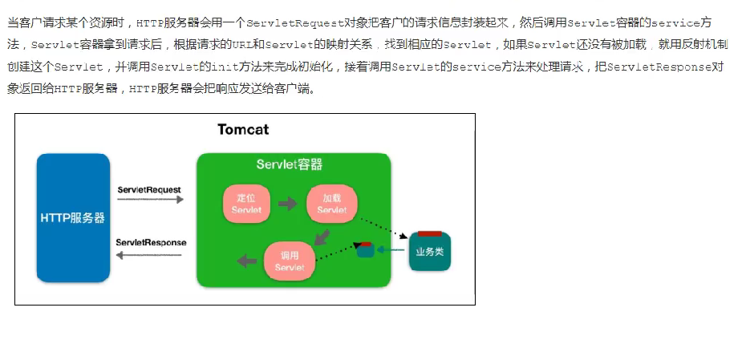
### 整体架构
连接器Connector+容器Container
一个容器可以对应多个连接器 他们的组合就成为一个service
连接器：对外交流，接受请求
容器：逻辑处理
#### 连接器
* 名字叫Coyote，封装了底层的网络通信（socket），将得到的请求封装为servletrequest交给容器
* io模型（传输层）：NIO、NIO2,APR
* 支持的应用层协议：HTTP/1,AJP,HTTP/2
##### 连接器的各个组件
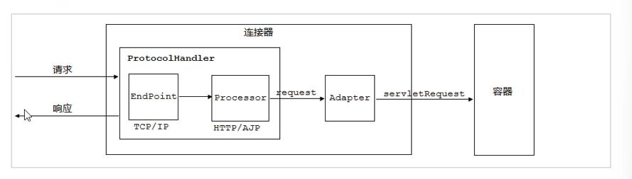
1.endpoint：通信端点，监听socket请求，tomcat中定义了一个AbstractEndPoint抽象类，里面包含和Acceptor：监听socket连接请求和SocketProcessor：处理接收到的socket请求
调用processor组件，这里涉及到利用线程池
2.processor：将socket请求实际解析为request和response对象，交给adapter
1和2统称为protocalHandler
3.adaptor：将request转化为servletrequest，交给容器，为什么不直接用processor一步封装到位？还要加一个adaptor
##### 线程池
* tomcat的线程池扩展自ThreadPoolExecutor，总线程数达到最大不会立即报错，而是会重新尝试
* 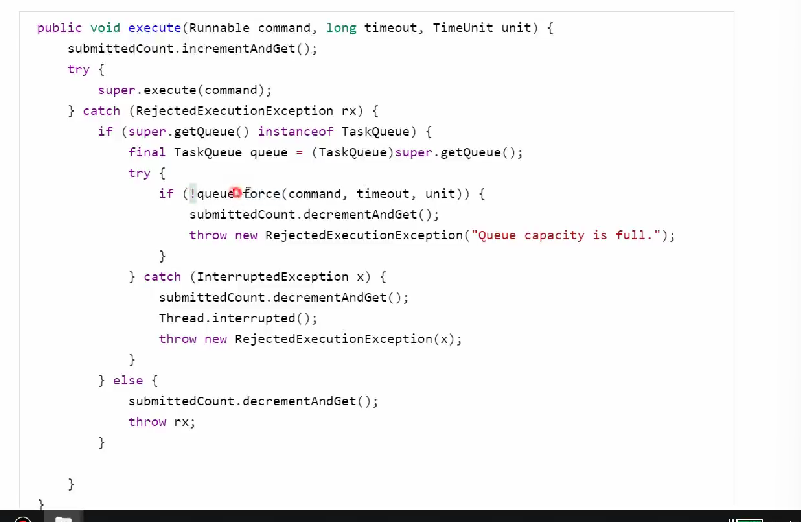
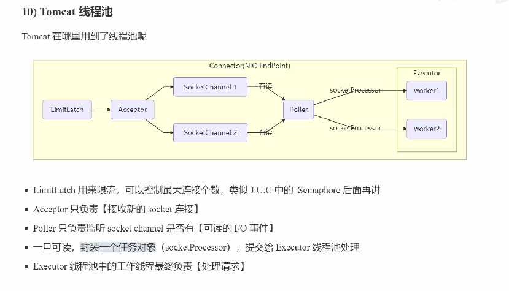
* 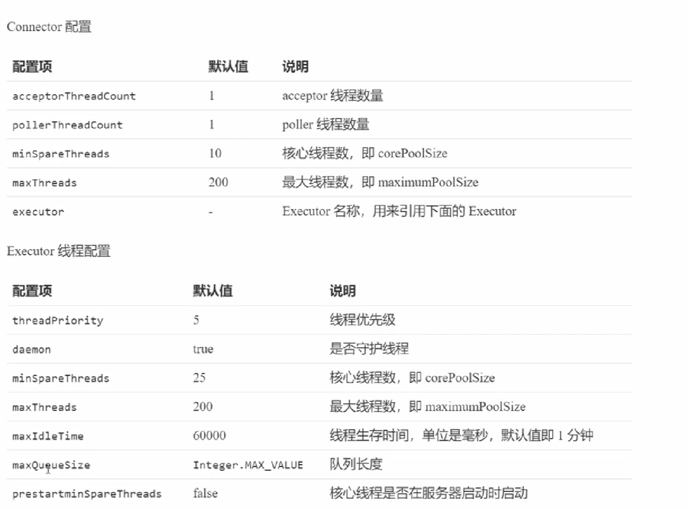
* 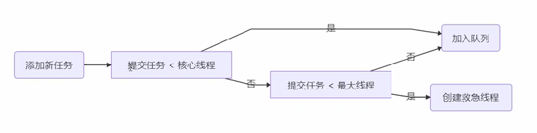
###### 相关配置
#### 容器container
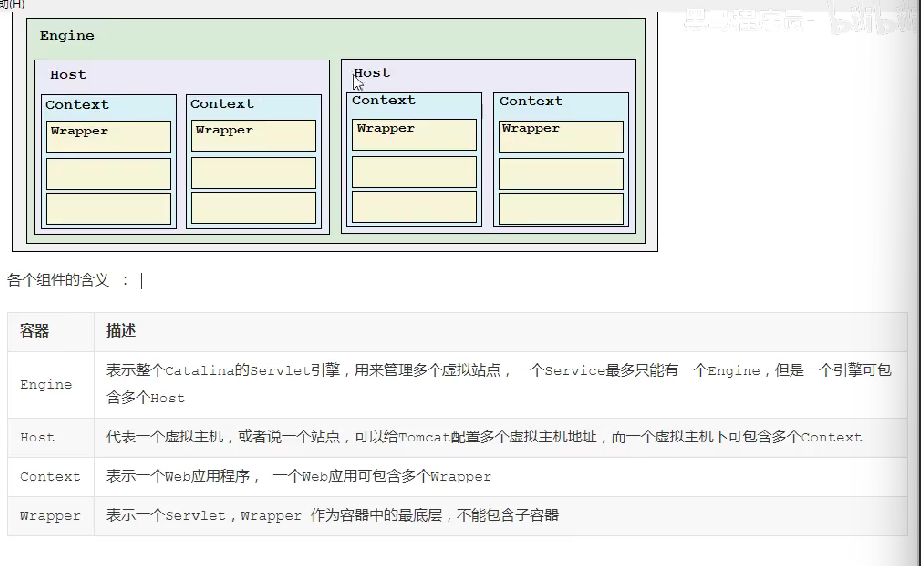
### catalina
* 负责管理server即整个服务器，server下有多个service，一个service包含连接器和容器
* 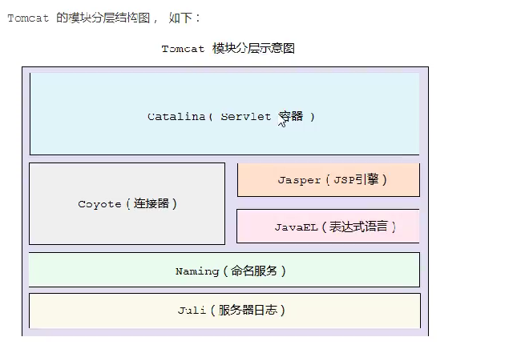
* 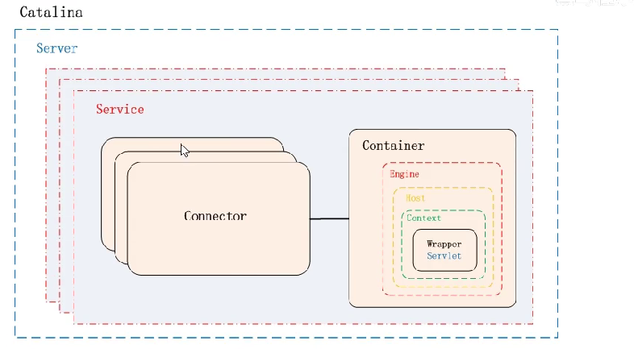
* 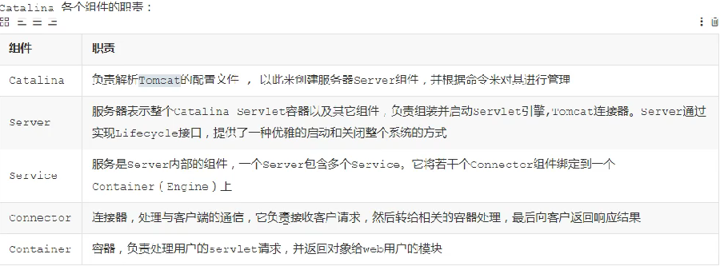
## tomcat的启动流程
1.调用catalina.startup.Boootstrap中的main方法
catalina对象是通过反射创造出来的命名为catalinaDeamon
catalina.load()中，创造xml解析器
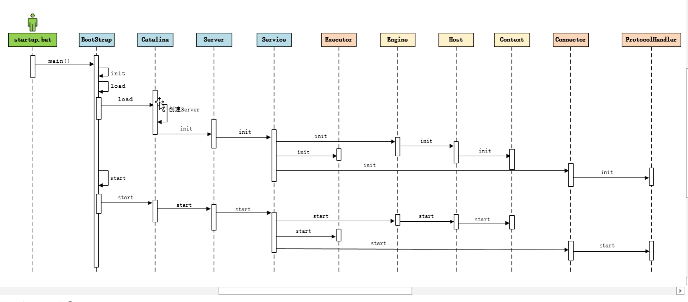
### 源码分析
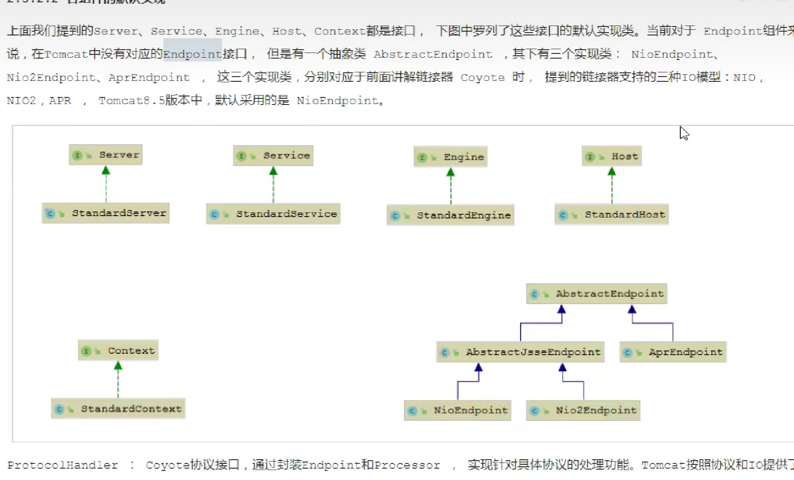
* lifecycle接口：抽象所有的生命周期
## tomcat的请求处理流程
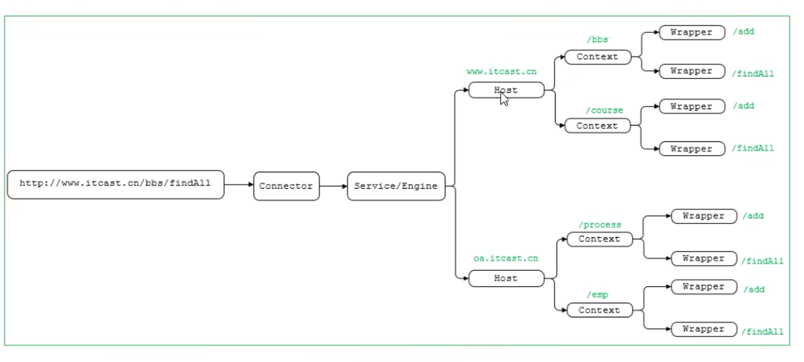
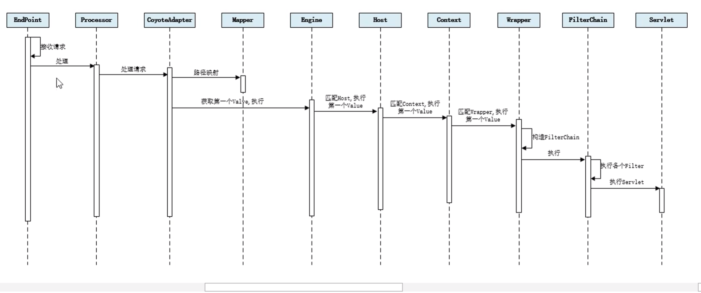
* 什么是责任链？
* 如何通过配置找到应该转发给谁？在哪配置的？在第几步找？
* 这个过程和我项目中之前总结的有什么区别
* 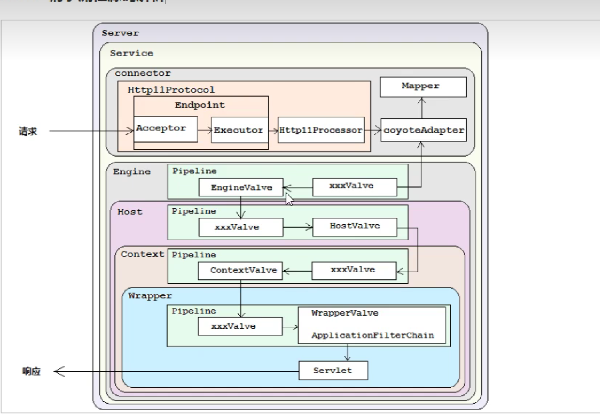
# jasper
什么是jasper？有什么作用？