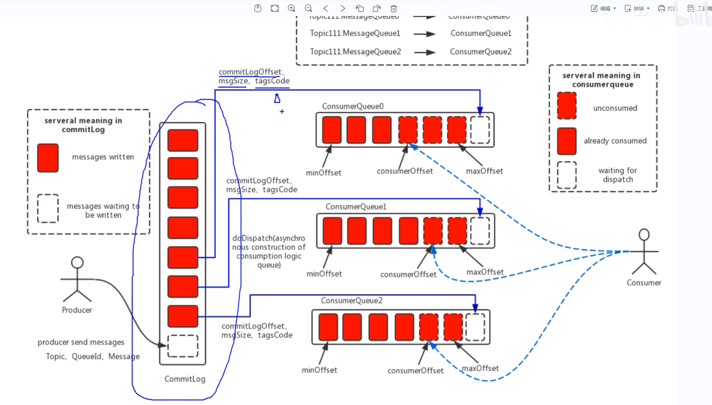

# 消息队列
* 作用：异步、削峰限流、解耦合
# RocketMQ的基本概念
* 是一款实现了消息队列的面向消息的中间件，吞吐量10M，延迟ms级
## RocketMQ的结构


## 消息发送和监听的流程

### 消息生产者
1.创建producer，指定生产者组名
2.指定nameserver的地址
3.启动producer
4.创建消息对象，指定主题Topic、Tag和消息体
5.发送
6.关闭
### 消息消费者
1.创建消费者consumer制定消费者组名
2.指定 Nameserver地址
3.创建监听订阅主题Topic和Tag等
4.处理消息
5.启动消费者consumer

## 一些基本的概念
1.Producer Group:生产者的组，同一个组的生产者可以发不同Topic的消息
2.Comsumer Group:一组消费同一个 Topic 的消费者实例。消费者的组，同一个组的消费者必须保持同样的订阅方式(订阅哪些Topic-Tag)，
请注意，广播模式或者负载均衡模式，是以组为单位来进行投递的，每个组都会有一份消息。
1.主题Topic:一个逻辑上的概念，生产者发消息的时候要指定消息的Topic，用于逻辑分类。
一个 Topic 包含多个物理队列（MessageQueue）。
2.队列Queue:一个Topic内有很多队列，队列和消费者组内的具体的每一个消费者，必须建立对应关系
分配算法（AllocateMessageQueueStrategy）把 Topic 的队列集合，拆分分配给组内活着的消费者。
### 两种边界情况

1. 消费者组内只有 1 个消费者：该消费者拿到该 Topic**全部队列**。
2. 消费者组内实例数量 > Topic 队列数量：**多出来的消费者不会分到任何队列，空闲，不消费消息**。

> 重要约束：**同一个队列，在同一个消费者组下，只会分配给组内其中一个消费者实例**（集群消费模式），这是 RocketMQ 负载均衡核心
3.消费者位点:
4.代理者位点

## 投递消息的两种方式
### push
有消息，mq就投递，实时性强，但容易导致客户端压力过大
本质上，push模式也是依靠pull封装实现
### pull
消费者主动去mq拉取消息，实时性不强，压力可控
# Broker（RocketMQ）
> Broker = RocketMQ真正干活的**服务端节点**，消息中间件的心脏，**有状态，存真实消息数据**。
> NameServer只是通讯录（无状态，不存消息）；**所有消息、消费偏移量、Topic元数据全部保存在Broker**。

## Broker核心职责
1. 接收Producer发送过来的消息，持久化落盘；
2. 处理Consumer拉取消息请求；
3. 保存元数据：消费组offset消费进度、Topic配置、订阅关系、重试队列、死信队列；
4. 实现高级能力：延迟消息、事务消息回查、消息过期清理；
5. 定时向所有NameServer上报自己的心跳、Topic路由信息，让客户端能发现自己。

## Master / Slave（主从）
同一个BrokerName代表一组副本；
- `BrokerId=0` → **Master主节点**：可读写；生产者写消息只能写给Master。
- `BrokerId>0` → **Slave从节点**：同步Master数据；**不接收写请求，只可以读**，分担消费读压力；Master宕机，旧版本不会自动切换，5.0支持自动选主。

> 复制模式：
> - 同步复制：Master写完，等Slave复制完成才返回成功；可靠性高，性能下降。
> - 异步复制：Master写完立刻返回，后台同步Slave；性能高，故障极端情况丢少量消息。

## Broker内部三大存储文件（面试高频）
1. **CommitLog**
   所有Topic的消息实体全部顺序追加写入CommitLog，**不分Topic混写**；单文件默认1GB，文件名是起始物理offset。磁盘顺序写，是RocketMQ高吞吐、堆积TB级消息的根源。

2. **ConsumeQueue**
   逻辑队列索引。`ReputMessageService`异步线程从CommitLog构建出来。
   按`topic/queueId`组织，每条记录20字节：存CommitLog物理偏移、消息长度、tag hash。
> 消费者消费时，先读ConsumeQueue拿到物理地址，再去CommitLog读真实消息体。
> ✅**MessageQueue（Topic里的队列）逻辑上等价于一组ConsumeQueue文件**。

3. **IndexFile**
   key消息索引，根据消息keys快速查询定位消息，用于运维排查，消费不走这个索引。

## 刷盘机制（Broker写消息两种策略）
1. **同步刷盘SYNC_FLUSH**：消息写入PageCache之后，强制刷到磁盘，返回成功；可靠性最高，性能差。
2. **异步刷盘ASYNC_FLUSH（默认）**：写到PageCache内存就返回成功，后台线程异步刷磁盘；性能高，机器断电会丢内存中未刷盘消息。

## Broker ↔ NameServer交互要点
1. Broker启动后，**向全部NameServer实例注册、定时发心跳**（默认30s）。
2. NameServer不主动推送路由；Producer/Consumer客户端定时拉取路由。
3. NameServer超过120s收不到Broker心跳，就把该Broker从路由表剔除。

## 和前面概念串起来（笔记版，可复制）
```markdown
1. Topic：逻辑分类；一个Topic分布在一台或多台Broker上，每个Broker上分配若干MessageQueue。
2. MessageQueue：Topic下的逻辑队列；底层对应Broker磁盘上ConsumeQueue索引，真实消息体存CommitLog。
3. Broker：有状态服务节点，存储CommitLog/ConsumeQueue/IndexFile；保存消费offset；定时上报路由给NameServer；分Master/Slave主从。
4. NameServer：无状态注册中心，只保存路由元数据，不存任何消息。
```

### 面试简答背诵
> Broker是RocketMQ服务端节点，负责消息接收、持久化存储、消费请求处理。分为Master和Slave，Master处理读写，Slave做数据备份分担读压力。
> 存储上所有消息混写在CommitLog，异步构建ConsumeQueue消费索引；支持同步/异步刷盘，同步/异步复制。Broker会向NameServer上报心跳路由信息。

## 常见blocker坑点
❌错误：Topic存在NameServer上。
✅事实：NameServer只存路由映射；**Topic真实元数据、消息全部存在Broker**。

❌错误：Consumer直接和NameServer拉消息。
✅事实：NameServer只返回Broker地址；消费请求直接打给Broker。

❌错误：MessageQueue是磁盘物理文件。
✅事实：MessageQueue是逻辑概念；底层存储载体是ConsumeQueue索引文件。
# RocketMQ 面试完整笔记
> 适用：Java后端面试笔记，包含架构模型、各类消息、顺序消息、坑点blocker、面试问答
> 已修正混淆点：msgModel/consumeMode、顺序消息发送消费边界、Broker故障队列漂移风险

```markdown
# RocketMQ 面试完整笔记
## 一、基础核心概念
### 1. NameServer
- 角色：**无状态注册中心、路由通讯录**，不存储消息体，不存储消费偏移量。
- 功能：保存 Broker、Topic 的路由元数据；提供 Broker 地址发现。
- 工作机制：
  1. Broker 启动向**全部 NameServer**上报心跳与路由信息，默认30s上报一次。
  2. Producer / Consumer 客户端定时从 NameServer 拉取路由表，NameServer不会主动推送。
  3. NameServer 120s收不到Broker心跳，则剔除该Broker路由。

> blocker
> ❌误区：NameServer保存消息数据
> ✅真相：消息、offset全部存储在Broker，NameServer只有路由映射。

### 2. Broker
Broker 是 RocketMQ **有状态服务节点**，真正存储消息、处理生产消费请求。
- 职责
  1. 接收Producer消息，持久化落盘。
  2. 处理Consumer拉取消息请求。
  3. 保存：消费offset、Topic配置、重试队列、死信队列、延迟消息。
  4. 向NameServer上报心跳路由。

#### Master / Slave 主从
- `BrokerId=0`：Master主节点，可读可写；生产者只能写Master。
- `BrokerId>0`：Slave从节点，仅读，不接收写请求，分担消费读压力。
- 复制模式
  - 同步复制：Master写完，等待Slave复制完成才返回成功；可靠性高，性能下降。
  - 异步复制：Master写完直接返回，后台异步同步Slave；性能高，极端故障可能丢少量消息。

#### Broker三大存储文件
1. **CommitLog**
所有Topic消息实体，全部顺序追加写入CommitLog，不同Topic消息混写；单文件默认1GB。
磁盘顺序写，是RocketMQ高吞吐、支持TB级堆积的核心。

2. **ConsumeQueue**
逻辑队列索引，由后台`ReputMessageService`线程异步从CommitLog构建。
按`topic‑queueId`组织；每条记录20字节：CommitLog物理offset、消息长度、tag hash。
消费流程：读ConsumeQueue拿到物理位置 → 去CommitLog读取真实消息体。
> MessageQueue逻辑队列底层载体就是ConsumeQueue。

3. **IndexFile**
消息key索引，用于根据message keys快速检索消息；**正常消费不走该索引，仅用于运维排查**。

#### 刷盘机制
1. **同步刷盘 SYNC_FLUSH**：写入PageCache后强制刷入磁盘再返回成功；可靠性高，性能差。
2. **异步刷盘 ASYNC_FLUSH（默认）**：写入PageCache内存直接返回成功，后台线程异步落盘；性能高，机器断电可能丢失PageCache内未刷盘消息。

### 3. Topic
逻辑概念，生产者发送消息指定Topic，用于消息逻辑分类。
一个Topic可以分布在一台或多台Broker上；一个Topic内部包含多个物理队列`MessageQueue`。

> blocker
> Topic只是逻辑分类；Topic元数据保存在Broker，不在NameServer。

### 4. MessageQueue
Topic下物理存储逻辑队列；底层对应Broker上ConsumeQueue索引文件。
- 集群消费模式下，通过rebalance重平衡机制，将Topic下的队列动态分配给消费组内消费者实例。
- 同一个消费组内，**一个队列只会分配给组内某一个消费者实例**。
- 如果消费者实例数量 > Topic队列数量：多出的消费者拿不到队列，空闲不消费。
- 消费者上下线会触发rebalance，队列分配关系动态变化，不是静态绑定。

> blocker
> ❌错误理解：队列和组内每一个消费者必须建立对应关系。
> ✅事实：队列动态分配，多余实例空闲。

### 5. ConsumerGroup 消费组
同一类业务消费者实例归为同一个消费组。
- 集群消费：组内多个实例负载均衡消费消息，一条消息只会被组内其中一个实例消费。
- 广播消费：组内每个消费者实例都消费全部消息。

### 6. msgModel（MessageModel）消费模式
> ⚠️重要：msgModel是**消费者端配置，生产者发送端没有msgModel**，它本身**不能实现顺序消息**。
```java
MessageModel.CLUSTERING   // 集群消费 默认：同消费组，一条消息只会被组内一个实例消费
MessageModel.BROADCASTING // 广播消费：同消费组，每条消息推送给组内全部消费者实例
```
- msgModel控制消费组内消息分发策略，和顺序消息逻辑互相独立；集群、广播两种模式下都可以做顺序消费。
- SpringBoot RocketMQ Starter注解区分：
    - `consumeMode = ConsumeMode.ORDERLY`：**这个才是顺序消费开关，底层对应 MessageListenerOrderly**，很多笔记错误把它记成msgModel。

---

## 二、发送各类消息
### 1. 同步消息 sync
producer发送消息，业务线程阻塞，等待Broker返回应答结果，拿到SendResult后继续执行业务。
- 底层：Netty同步等待response。
- 成功返回SendResult；失败抛出异常。
- 适用：重要业务消息，必须确认投递成功；订单创建、支付事件。
- 缺点：占用业务线程，增加业务RT；需要配置合理超时。

### 2. 异步消息 async
producer发送请求立刻返回，不阻塞业务线程；Broker处理完成后回调`SendCallback`。
- ⚠️回调运行在Netty IO线程，回调中禁止执行耗时业务，会阻塞IO线程池。
- 适用：不能阻塞主线程，但又需要感知发送结果（记录失败日志、告警）。

> blocker
> ❌异步发送不能用于顺序消息。并发异步发送网络返回时序不确定，即便发到同一个队列，回调应答顺序也乱。

### 3. 单向消息 one‑way
只管网络发出请求，不等待Broker应答，无回调，完全不关心发送结果。
- 性能三者最高；允许少量消息丢失。
- 适用场景：日志埋点、统计上报。

> blocker
> 无法感知发送失败；重要业务禁止使用。

性能排序：单向 > 异步 > 同步。

### 4. 延迟消息
消息投递Broker后，不会立刻对消费者可见，等待指定时间之后才可以消费；等待逻辑全部在Broker完成，不是客户端sleep。
- 业务场景：订单30分钟未支付关闭、超时提醒。
- 底层实现：消息先写入内部系统topic `SCHEDULE_TOPIC_XXXX`，到期后转发到真实业务Topic。
- 版本差异
    - 旧版本：只支持预设延迟等级，不能自定义任意时间。
    - RocketMQ5.x：支持时间戳自定义任意延迟。

> blocker
> 1. 延迟消息不能和事务消息一起使用。
> 2. 时间存在秒级误差，不是绝对精准。

### 5. 顺序消息
> RocketMQ仅支持**队列内局部有序**，不天然支持全局有序。
定义：消费者处理消息顺序与生产者发送顺序保持一致。

#### 为什么会乱序
1. Topic包含多个MessageQueue队列。
2. 消息分散路由到不同队列。
3. 多个消费者并行消费不同队列，线程处理速度不一致，消费顺序错乱。
> 只要消息落到不同队列，就无法保证顺序。

#### 发送端实现顺序消息
目标：同一业务key的消息，尽量路由到同一个MessageQueue。
```java
send(msg, MessageSelector.hash(arg), arg);
```
- arg：业务key，orderId/userId。
- 底层逻辑：对arg做hash，对Topic队列总数取模，计算目标队列下标。

✅正常运行前提：**Topic队列数量固定，并且目标队列Broker正常可用**。
此时同一个业务key，会固定选择同一个队列，实现局部有序。

> blocker
> 1. 如果Topic队列数量扩容/缩容：hash取模分母改变，相同业务key映射到新队列；历史消息在旧队列，新消息到新队列，顺序直接破坏。**顺序消息Topic尽量禁止动态修改队列数量。**
> 2. 如果hash计算命中的队列所在Broker宕机不可写，生产者会自动选择其它可用队列发送；同key消息会漂移到其它队列，顺序被打破。这是RocketMQ hash路由的固有风险。
     > ✅发送建议：顺序消息优先同步send，不要异步发送；异步发送回调时序不可控。

> 注意：MessageSelector.hash(arg)只能保证【正常无故障、队列数不变】条件下同key进入同一个队列；Broker故障场景下不保证。

#### 消费端实现顺序消息
`MessageListenerOrderly` 顺序消费监听器。
对比：`MessageListenerConcurrently`并发监听器，多线程处理，**不能实现顺序消费**。

##### MessageListenerOrderly底层
1. **队列消费锁**：同一个队列同一时刻只允许一个线程消费。
2. 处理完成一条消息，再拉取下一条。
3. rebalance分配队列成功之后，持有对应队列锁。

> blocker
> 1. 消费失败返回`RECONSUME_LATER`，会本地无限重试，不会直接进入Broker重试队列；持续失败会阻塞整个队列。业务必须做重试上限，达到阈值转入死信队列。
> 2. 一旦顺序消息进入RETRY重试队列，脱离原队列，顺序直接失效。

#### 局部有序 vs 全局有序
1. **局部有序（业务常用）**：同一个业务key消息有序，不同业务key之间不做顺序保证。依靠hash路由到同一个队列实现。
2. **全局有序**：整个Topic所有消息严格有序。实现：Topic只设置1个MessageQueue。缺点：吞吐量极低，无法横向扩展，生产极少使用。

---

## 三、高频面试问答
### Q1：异步发送能不能做顺序消息？
不能。异步发送网络应答返回时序不确定，即便发送到同一个队列，回调收到应答顺序也乱；顺序消息推荐同步发送。

### Q2：发送端固定同一个队列，消费端用并发监听器是否可以保证顺序？
不行。并发监听器多线程处理同一个队列消息，业务处理阶段并行，依旧乱序；消费端必须使用`MessageListenerOrderly`。

### Q3：顺序消息消费失败表现？
MessageListenerOrderly返回重消费，执行本地无限重试，消息不会直接投递Broker重试队列；持续失败会阻塞整个队列。业务必须做重试上限，达到阈值转入死信队列。

### Q4：Topic队列扩容，对顺序消息的影响？
MessageSelector.hash基于队列总数取模；队列数变化，hash结果改变，相同业务key路由到不同队列，顺序被破坏。顺序Topic尽量避免修改队列数量。

### Q5：延迟消息底层原理？
Broker收到延迟消息，写入内部系统Topic `SCHEDULE_TOPIC_XXXX`；后台线程扫描，到达延迟时间，转发到真实业务Topic供消费者消费。

### Q6：同步、异步、单向消息性能对比？
单向消息性能最高，其次异步消息；同步消息因为等待Broker应答RT最高。

### Q7：集群消费下，消费者实例大于队列数量会发生什么？
多余消费者不会分配到任何队列，处于空闲状态，不消费消息。

### Q8：NameServer、Broker分别存什么？
NameServer：只存路由元数据，无消息、无offset。
Broker：存储CommitLog/ConsumeQueue；保存消费offset、Topic配置、重试、死信、延迟消息。

### Q9：msgModel可以实现顺序消息吗？
不可以。msgModel是消费端集群/广播分发模式；和顺序无关。真正开启顺序消费的是消费端`MessageListenerOrderly`（Spring中`consumeMode = ConsumeMode.ORDERLY`）。

### Q10：如果业务要求绝对不能乱序，即使Broker宕机也不行，如何处理？
将该强顺序业务单独使用一个Topic，只配置1个队列，实现全局有序；代价吞吐量受限，无法横向扩展。

# Topic、Tag、Key
## Topic
消息的一级逻辑分类；生产者发送消息必须指定Topic。
不同业务大类建议拆分不同Topic。
例：`order_topic` 订单业务。
## Tag
> 用于**同一个Topic内部做二次细分过滤**，是消息的二级标签。
发送消息时给消息设置tag；消费者订阅topic时，可以按tag过滤消费。
```java
//发送设置tag
Message msg = new Message("order_topic", "order_pay", body);
//消费订阅，只消费order_pay标签
consumer.subscribe("order_topic", "order_pay");
```
- 支持或关系过滤：`"order_pay||order_cancel"`
- 订阅`*`代表消费该Topic下全部tag的消息。
> blocker
1. ❌不能做复杂逻辑过滤（AND、NOT），只支持或；复杂过滤要业务代码里做。
2. Tag只是字符串标签，**不拆分队列**。同一个Topic下所有tag消息全部写入同一批MessageQueue。Tag过滤是**客户端过滤**：broker把消息推给consumer，消费者本地做tag匹配，不匹配直接丢弃。
> ⚠️坑：如果tag过滤之后大量消息被丢弃，Broker那边offset依然会前进，消息直接丢掉，不会重试。
## Key（message keys）
消息业务主键，业务侧设置，比如orderId。
```java
msg.setKeys("ORDER_10086");
```
- 作用：用于运维排查，**可以通过key在Broker索引文件IndexFile快速检索定位这条消息**。
- 不参与路由、不参与消费过滤。
- 多条消息可以设置同一个key。
> blocker
> Key不是索引，不会加速消费；仅用于运维检索消息；消费流程完全不走key。
## Topic / Tag / Key 使用对比总结
| 概念 | 作用 | 生效位置 | 是否拆分队列 |
|---|---|---|---|
| Topic | 一级业务分类 | Broker路由层面 | ✅会拆分MessageQueue队列 |
| Tag | Topic内二级细分过滤 | **消费客户端本地过滤** | ❌不拆分队列 |
| Key | 消息业务标识，用于查询定位 | Broker IndexFile索引 | ❌不拆分队列 |

> 最佳实践
> 1. 不同大业务拆分不同Topic；不要把完全无关业务塞到同一个Topic靠tag区分。
> 2. Tag适合同一业务内少量子类型过滤；大量消息过滤不要依赖tag，容易出现消息丢弃。
> 3. 重要消息尽量设置keys，方便线上问题排查。

---

### 面试简答背诵
> Topic是一级逻辑分类，会拆分队列；Tag是同一个topic下二级标签，用来过滤消息，过滤逻辑发生在消费客户端，不会拆分队列；Key是消息业务主键，写入IndexFile索引，只用于运维检索消息，不参与路由和消费过滤。
> 注意Tag过滤，如果大量消息不匹配tag，消息会直接被消费者丢弃，offset继续往前走，消息丢失。

### key应用-消息去重，保证幂等
#### 为什么会出现重复的消息
1.消费者多次投递
2.消费者方扩容
#### 解决方案
用 redis/mysql 保存每一个业务的唯一的key，如果插入成功即成功，如果报错失败则
表明之前处理过，直接把这条消息消费掉即可
注意，要用try-catch
## 消息重试和死信队列
* producer发送消息之前可以设置重试的最大次数，默认为2，这个重试指的是broker没有成功返回ack
* consumer重试的时间间隔10s 30s 1m 2m ....1h 2h。
* 并发模式下最多重试16次（注意顺序模式下是无限次，因为要保证顺序逻辑），如果重试16次都失败都失败，会认为消息是一个死信
贼会放在死信主题中，对应的Topic名称有规律%DLQ%原topic
* 可以设置最大重试次数，让其还没重试到16次就进入死信
## 消息处理失败之后(指错误被抛出去？即不是和去重那样try-catch了)，如何正确的处理

# 和Spring boot整合
* 配置yml文件后直接注入RocketMQTemplete
* 消费者通过@RocketMQMessageListener注解表明
  * 同时需要继承自RocketMQListener<T>,T需要制定消息体的参数类型
  * 但如果写成MessageExt的类型，会得到消息头+消息体一起封装的类型
  * 重写其OnMessage方法
  * 注解中的consumerMode，可以配置是顺序消费模式还是并发消费
  * 注册中的selectorType，可以配置是否是Tag过滤模式
  * selectorExpression，可以配置到底过滤哪些
  * 注解中的consumerSThreadNumber 可以设置消费者线程的数量：一般IO密集型任务
  2 * n，但是内存密集型是n+1；
  * 注解中的messageModel可以用来配置是集群模式还是广播模式
  * msgTrace可以配置是否记录消息轨迹
* MessageBuilder：可以用其来创建消息，创造者模式
* 发消息的时候tag：就是用：和Topic隔开就行了，不用单独传一个tag
## 消息被消费的两种模式
* 负载均衡(集群模式)模式和广播消息模式
* 集群模式负载均衡：多个消费者交替消费同一个主题中的消息，mq会自动做负载均衡，让同一个组里的消费者来分摊
* 广播：每个消费者都消费一遍订阅主题的消息
## 如何处理消息堆积的问题
### 什么情况下会出现堆积？
1.生产太快了：生产者业务限流，并且可以增加消费者的数量
2.同一个topic的队列可以分写队列和读队列来区分读和写，一个队列能读+写都可以
只能标注有几个被分为写，有几个被分为读
3.消费者
4.排查消费者程序的问题，可以恢复消费点位
## 如何确保消息不丢失
mq自己有持久化，同时业务侧也维持一个消息信息
## 消息轨迹
### 什么是消息轨迹？
* 消费者方轨迹和发送方轨迹
### 消息轨迹是如何实现的？
## 安全
* 需要在配置中配置aclEnable=true
* 开启之后每次访问需要添加账号密码才可以，可以修改plan_acl的config文件
* rocketmq的面板也需要配置账号密码，注意面板和nameserver之间的区别

## Rocketma的设计

主要就是由COmmitLog和ComsumerQueue组成，同时提供了indexfile索引文件
CommitLOg中每个部分是变长的，而ConsumerQueue中每个表项固定20字节

rocketmq自己的持久化设计