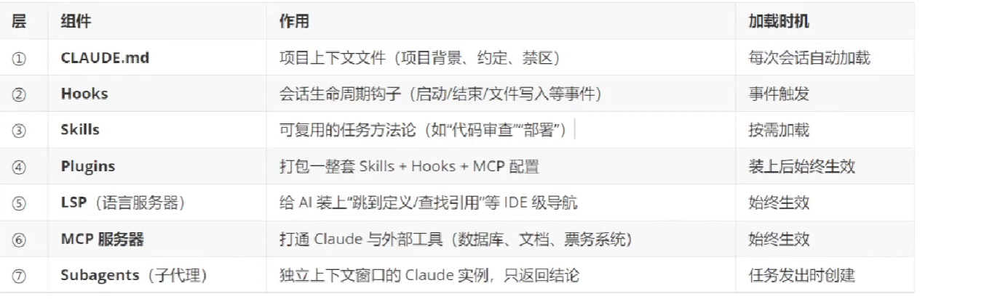
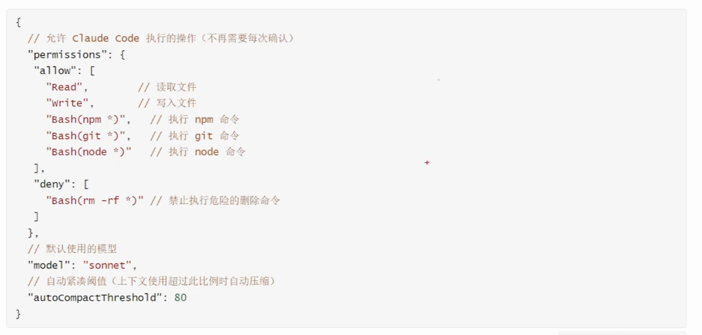
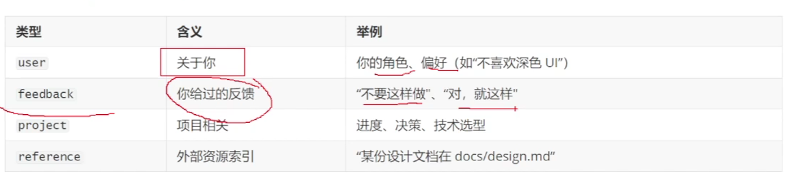

* vibe coding：氛围感编程，意图优先，快速迭代，信任但验证，上下文经营
* agent：能够自主完成任务，能够规划并且执行多个步骤，即可以调用各种工具，进行读写文件、运行命令、搜索代码、调用工具
  * 感知->推理->行动->反馈
* 任务分解原则：MECE,相互独立，完全穷尽
* 规范驱动开发(SDD)，
* 产品需求文档PRD.md
* 技术规范文档(SPEC),描述怎么做，包括系统架构等
* 质量规范:做到什么程度算合格
* 规范文件的组织与管理
# Claude Code
实际上是一个AI 编程 Agent，是一个工具而不是模型本身，可以实现LLM Loop：思考，行动，观察，再思考。
其底层到底用什么模型可以替换。
* Harness七层扩展点

## settings.json
有一个全局的配置和一个项目级的配置

## 三层记忆
* 本质上是在合适的时候向大模型注入压缩过的上下文
### 第一层：Claude.md
* 每次新开对话都自动加载
* 也分级别，全局级/项目级/模块级
* 项目级的文档应该是动态的，随着项目更新而更新
* 只放顶层不变原则，适度简介，不要写成论文
* # Claude.md（Cursor / Claude Code 项目记忆文件）
> 概念：`Claude.md` 是**上下文注入文件**，新开对话自动加载，分三层优先级：
1. **全局级**：用户本机全局，所有项目对话都加载
2. **项目级**：项目根目录 `Claude.md`，随git提交，团队共享，跟随项目迭代更新
3. **模块级**：子目录内 `Claude.md`，仅该目录下对话生效

> 原则：只放**顶层不变原则、项目约束、编码规范、架构约定**；不要堆业务细节，不要写成长篇论文，控制精简。

## 你的核心疑问：更新是每次执行 `init`，还是手动改文件？
### 1、`init` 命令做什么
`/init` 是**一次性生成初始模板**：
- 第一次：检测项目，自动生成一份初始 `Claude.md`（架构、技术栈、编码约定）。
- ⚠️**`/init` 不会自动更新已有 `Claude.md`！它不会做增量合并。**
    - 如果本地已经存在 `Claude.md`，执行 `/init`：要么跳过，要么直接覆盖，**不会智能diff合并新旧内容**。

> ❌不要指望反复跑 `/init` 来同步更新项目变化；反复init容易把你手写的规则直接冲掉丢失。

### 2、正确更新模式
#### 模式A：手动编辑（**项目级最推荐，日常主要方式**）
直接在IDE打开 `Claude.md`，像改普通文档一样修改保存。
保存完成后：**新开对话就会自动读取最新版本**。
> ✅生效规则：已经打开的旧会话不会刷新；**只有新建对话才会加载修改后的Claude.md**。
> 已经在聊的老会话，不会自动重读磁盘上的md文件。

#### 模式B：让AI帮你修改它
在对话里直接指令：
```
更新Claude.md，新增一条约定：xxx
把Claude.md里面的xxx规则修改为xxx
删除Claude.md中xxx条目
```
AI会直接读写磁盘修改这个文件，你不需要复制粘贴。修改完保存，新开对话生效。

#### 模式C：什么时候才重新跑 `/init`
适合场景：**项目发生巨大技术栈重构**（比如Spring项目改成微服务、整个技术栈大换血）。
> 操作前务必备份旧的`Claude.md`，init会覆盖，你再把自己手写的业务/编码约定补回去。
> 小迭代、新增接口、新增模块**不要用init**。

## 重要关键点
1. `Claude.md` 是**磁盘静态文件**，不是AI内部记忆。AI不会自动扫描代码变更、自动改写这个文件。**不会自动同步项目变化，需要人驱动更新**。
2. 老会话缓存：已经存在的聊天窗口，会使用会话创建那一刻读取到的`Claude.md`内容；后续磁盘改文件，老对话不会感知。想要新规则，开新对话。
3. 项目级建议纳入git版本控制：多人协作，大家共享同一套顶层约束。
4. 内容取舍：
    - ✅放：包结构规范、异常处理约定、过滤器顺序、命名规范、架构分层、安全约束、禁止的写法。
    - ❌不要放：业务接口细节、数据库每条表字段、长篇源码，会占用大量上下文窗口。

## 极简总结
> 1. `/init` 仅用于**初次生成模板**，不做增量更新，重复执行有覆盖丢失风险；小更新**不要用init**。
> 2. 日常更新：IDE手动编辑，或者发指令让AI直接修改磁盘上的`Claude.md`。
> 3. 修改保存后，**仅新开对话生效；旧会话继续用旧版本内容**。
> 4. 只有项目技术栈整体大重构，备份后再重新执行 `/init`。

如果你需要，我可以给一份适配你当前 `booksystem` SpringBoot+JWT项目的精简版 `Claude.md` 样例。
# Claude.md 当前会话热加载现状
> ⚠️原生**没有内置 `/reload` 命令**。
`CLAUDE.md` 只会在**会话刚启动那一刻一次性读取并注入上下文**；你在IDE修改磁盘上的文件，**已经打开的现有会话不会自动感知、不会自动重读磁盘文件**。
> GitHub官方issue确认：目前不支持热更新，修改后只对**新开对话生效**。

## 当前会话想读到最新内容，有3种可行手段
### 方案1：手动指令，让AI当场重新读取磁盘文件（最常用，不丢失聊天历史）
直接把下面这段话复制发给AI：
```
现在忽略本会话一开始加载的旧版CLAUDE.md，立刻读取磁盘上项目根目录的CLAUDE.md完整内容，把它作为你接下来全部输出必须遵守的最新规则。
```
- 原理：强制工具重新`cat`读磁盘最新文件，把内容再次喂进当前上下文。
- 优点：**不用新开会话，保留全部聊天历史记录**。
- 缺点：占用一部分token；如果对话很长，后面上下文窗口挤压，后面轮次有可能被挤出窗口，偶尔会遗忘。

> 如果有全局级的`~/.claude/CLAUDE.md`，就一并加上指令，让它同时读取全局那份。

### 方案2：`/clear` 清空当前会话上下文（相当于本窗口原地重启会话）
输入斜杠命令：
```
/clear
```
- 效果：清空当前窗口所有聊天历史，**在同一个窗口内部相当于新建会话，会重新读取磁盘最新的CLAUDE.md**。
- 缺点：**之前全部对话历史直接清空，不可恢复**。
  适合：旧对话已经不重要，只想保留窗口，不想新开标签页。

> ❗区分：`/clear`≠退出会话；它清空上下文，重新加载CLAUDE.md；不是关闭终端。

### 方案3：真正新开对话（最稳、最标准，官方推荐）
新开一个对话窗口。
✅保证100%读取磁盘上最新`CLAUDE.md`，没有上下文污染，不会出现旧规则残留。

## ❌哪些操作是无效的，不要试
1. 修改磁盘保存文件 → 继续在老对话聊天：**无效，老会话还在用启动时读到的旧文本**。
2. 执行`/init`：不会重读现有claude.md；要么跳过，要么直接覆盖磁盘文件，**不会刷新当前会话上下文**。
3. `/reload‑plugins` / `/reload‑skills`：只刷新skill技能文件，**不会处理CLAUDE.md**。

## 实际工作流建议（日常开发）
1. 小修改`CLAUDE.md`：用**方案1**，发指令让它现场重新读取磁盘文件，继续当前对话。
2. 改动比较大、规则改动多：优先**新开对话**，避免旧规则残留在上下文带来诡异行为。
3. 不要指望改完文件老会话自动生效，这是很多人踩的坑。

## 补充一个小坑
哪怕是**AI自己在会话内部帮你修改了磁盘上的CLAUDE.md**，**当前这轮对话依旧看不到自己刚写进去的新规则**，只能新开会话或者手动指令重新读取磁盘文件才会生效。

> 举例：你说“把这条约定写入Claude.md”，AI写入磁盘成功，但是本轮会话后续输出还不会遵守这条新约定，必须重新读文件。

如果你需要，我可以给你一条可以直接复制粘贴、完整的提示词，包含读取项目级+全局级claude.md。
### 第二层：Auto Memory

### 第三层：自建参考文档
将特别细节的东西额外的使用文档记录，在CLAUDE.md里说明索引
## 基础文档
# Codex
实际上是一个AI 编程 Agent，是一个工具而不是模型本身。

