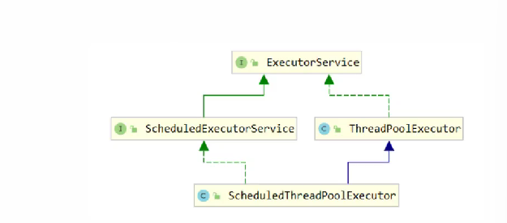
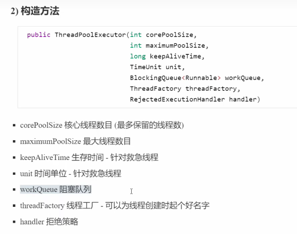
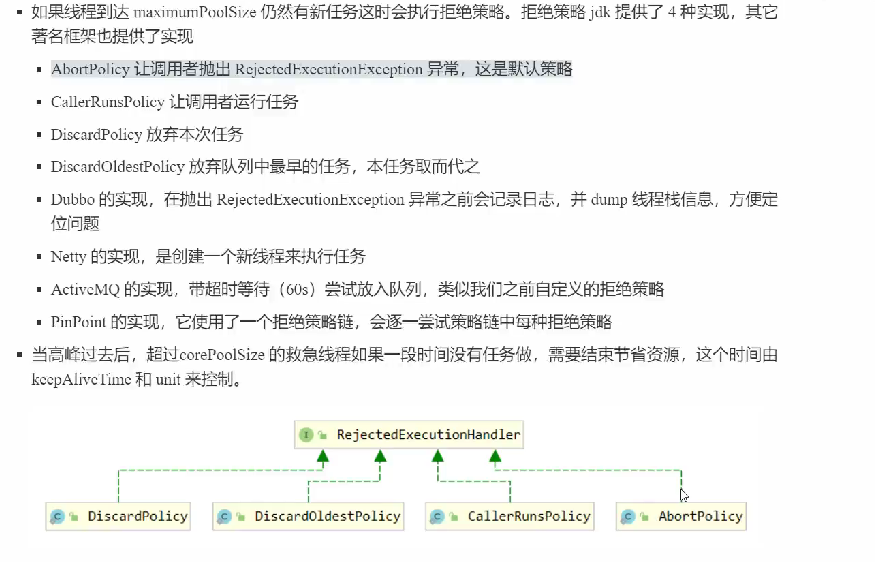
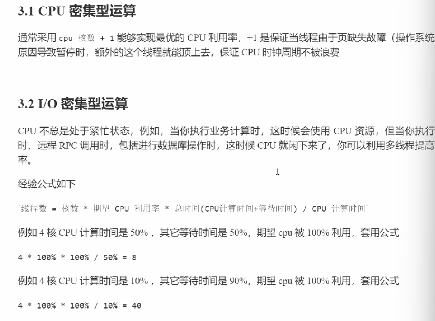
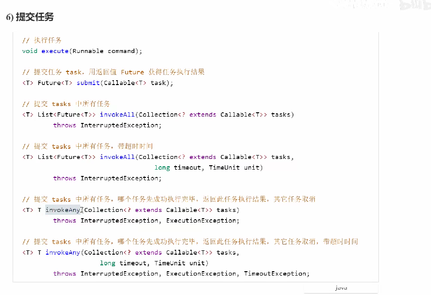
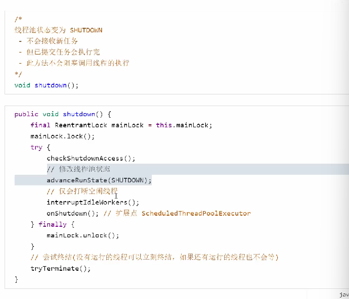
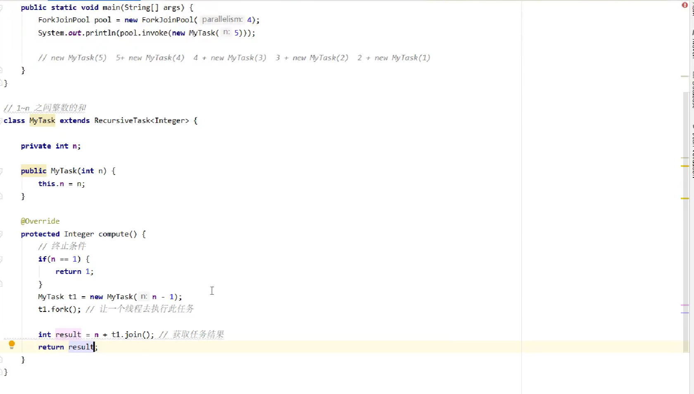

# 加锁
## synchronizied
### 原理
* 管程
### 使用
### 行为特性
## park()/unpark()
# 无锁
* 创造一个atomicinteger，在外面使用的时候
* 先获取再得到要修改的，最后真正修改，使用CAS：比较并设置
* 为了保证每次得到的是最新数据，要结合volatile
* 适用线程数少，多核cpu，体现的是乐观锁：不上锁，重试
* 无锁并发
## CAS的工具类
### 原子整数
AtomicBoolean、AtomicInteger ，AtomicLong
### 原子引用
AutomicReference<T>,创造的时候要传入包装类
* 问题，只能判断和初值是否相同，不能感知到中间确实有过修改，增加版本号
* markable：只关心是否被改变，所以引入一个标记，只关心标记的false或者true
### 原子数组
* 多线程下数组是不安全的，引入atomicintegerarray
* 要保护的类型是数组，和原子引用的区别是数组还要再包装一层，原子引用无法保护更下一层
### 字段更新器
* 针对对象的某个字段进行原子操作，这个字段必须被volatile所修饰 
* 创造的时候就指定类、字段类、字段名
### 原子累加器
* 专门用来做累加的类,LongAddr(),设置多个累加单元，最后将核心汇总
#### 源码
* 累加单元数组
* 基础值
* cellsbusy：cells创建或者扩容时用来枷锁
* cas锁
* 缓存行：缓存以缓存行为单位，每个缓存行对应着一块内存，一般是64byte
* 如果cpu是多核心的，如果某个cpu核心更改了数据，那么其他cpu核心所对应的整个缓存
* 行必须失效，这样才能保持数据的一致性
* sun.misc.contended用来解决伪共享
#### unsafe对象

# 不可变
## 不可变的设计
### string和包装类、BIgDecimal
* final：在赋值之后会加入一个写屏障，也可以保证可见性，读取有优化
* 保护性拷贝---创造对象太多，为了解决这个问题引入享元模式
* 享元模式：用于重用对象，包装类、字符串常量池，连接池
* 无状态：没有任何的成员变量，也就是没有线程安全问题
# 并发工具
## 线程
* 常用方法 runnable thread callable future的区别和联系是什么？有点混
# Runnable / Thread / Callable / Future 区别与联系

>
> 核心记忆：

1. **Thread 是线程类**；
2. **Runnable 无返回值、无异常抛出**；
3. **Callable 有返回值、可以抛异常**；
4. **Future 用来接收 Callable 的执行结果**。

## 1. 接口/类定义

### ① Thread（类）

```
public class Thread implements Runnable
```

- **是类，不是接口**，继承 `Object`，实现了 `Runnable`。
- 真正代表操作系统线程对象，调用 `start()` 开启新线程；`run()` 只是普通方法。
- 两种用法：
    1. 继承 Thread，重写 `run()`
    2. 构造传入 Runnable 对象 `new Thread(runnable).start()`

>
> ⚠️重点：`run()` 直接调用只是普通方法，**不会新开线程；必须调用 `start()` 才会创建操作系统线程**。

### ② Runnable（接口，JDK1.0）

```
@FunctionalInterface
public interface Runnable {
    void run();
}
```

- 函数式接口，**无返回值，run 不能抛出受检异常**。
- 作用：封装**线程要执行的业务逻辑**，和线程对象 Thread 解耦。
- 使用：传给 Thread 构造器，或者线程池执行 `executor.execute(runnable)`。

### ③ Callable（接口，JDK1.5）

```
@FunctionalInterface
public interface Callable<V> {
    V call() throws Exception;
}
```

- 函数式接口，**有泛型返回值V，call()允许抛出异常**。
- 专门解决 Runnable 的痛点：不能拿返回值、不能抛出异常。
- **不能直接丢给 Thread**！Thread 构造器不接收 Callable。

### ④ Future（接口，JDK1.5）

```
public interface Future<V> {
    V get() throws InterruptedException, ExecutionException;
    V get(long timeout, TimeUnit unit);
    boolean cancel(boolean mayInterruptIfRunning);
    boolean isCancelled();
    boolean isDone();
}
```

- Future 代表**异步任务的结果凭证**。
- `get()`阻塞等待获取Callable返回结果；任务出错会把异常包装成`ExecutionException`抛出。
- 常用实现类：`FutureTask`。

## 2. FutureTask 桥梁（非常关键）

`FutureTask implements RunnableFuture<V>`，而 `RunnableFuture` 同时继承 `Runnable` + `Future`。

```
FutureTask → RunnableFuture → Runnable, Future
```

- FutureTask 包装 Callable，既可以传给 Thread，又可以拿到 Future 的结果。

```
Callable<Integer> callable = ()->{return 100;};
FutureTask<Integer> task = new FutureTask<>(callable);
new Thread(task).start(); // 当作Runnable传给Thread
Integer res = task.get(); // 当作Future拿返回值
```

>
> 线程池 `submit(callable)` 底层就是帮你封装成 FutureTask，返回 Future 对象。

## 3. 四者对比表

| 类型 | 类型 | 方法 | 返回值 | 异常 | 能否直接给Thread |
| --- | --- | --- | --- | --- | --- |
| Thread | class | start() / run() | void | - | ✅本身就是线程 |
| Runnable | interface | run() | void | 不能抛受检异常 | ✅ |
| Callable | interface | call() | V泛型返回 | 可throws Exception | ❌，需要FutureTask包装 |
| Future | interface | get()/cancel() | V | get会抛异常 | ❌，存结果 |

## 4. 联系梳理

1. **Thread 负责线程调度，Runnable/Callable 负责业务逻辑**
    - Thread 是“工人”，Runnable/Callable 是“要干的活”。
2. Runnable：无返回任务；Callable：需要返回值的任务。
3. Callable不能直接给Thread，**必须套一层FutureTask（同时实现Runnable+Future）**。
4. Future 只是结果的契约，FutureTask是它最重要实现。
5. 线程池：
    - `execute(Runnable)`：无返回
    - `submit(Runnable)` → 返回Future
    - `submit(Callable)` → 返回Future

### submit(Runnable)小细节

submit也可以传Runnable，返回Future，但是get()会返回null；
如果想要Runnable也有返回值，可以用重载 `submit(Runnable, T result)`，get返回传入的result。

## 5. 常见易错点

1. ❌调用`thread.run()`，不会新建线程，只是普通方法执行；必须`start()`。
2. ❌直接 new Thread(callable) 编译报错，Callable不是Runnable。
3. ❌`future.get()`会阻塞，如果任务没完成，会卡住线程，要注意超时。
4. Runnable.run不能throws异常，只能内部try‑catch；Callable.call可以throws Exception。

## 6. 代码示例汇总

```
//1.继承Thread
class MyThread extends Thread{
    @Override
    public void run() {}
}
new MyThread().start();

//2.Runnable
Runnable r = ()->{};
new Thread(r).start();

//3.Callable + FutureTask
Callable<Integer> c = ()->{
    return 666;
};
FutureTask<Integer> ft = new FutureTask<>(c);
new Thread(ft).start();
Integer val = ft.get(); //阻塞拿结果
```

如果你需要，我可以再帮你整理面试背诵版极简口诀。
## 线程池
### 大概逻辑（不完全一样，需根据源码改）
* 线程池+阻塞队列(还没有获得线程的任务阻塞在这里)
  * 阻塞队列：任务队列，锁lock(获取线程时需要对队列加锁，保证安全性），生产者条件变量lock.newCondition、消费者条件变量
  容量。方法包括：阻塞获取，阻塞添加,超时添加(超过超时时间会失败)
  加锁：lock.lock(),唤醒某个condition上等待的线程condition.signal()，在某个条件上等待condition.await()(我不太清楚这个会不会放弃cpu)
  有限时间等待 condition.awaitNanos(time)，有一个虚假唤醒的问题需要解决。什么是虚假唤醒？怎么解决？
  * 线程池：阻塞队列taskQueue+阻塞队列的容量上限+线程集合(workers集合)+线程数+获取任务的超时时间
    * 线程worker:任务+run():task不为空的时候执行任务，task执行完毕就从taskQueue中取一个新任务run
拒绝策略：线程池中的阻塞队列满了的时候，需要根据自己定义的拒绝策略来选择如何处理，一般来说拒绝策略是一个抽象接口
    * 可以有很多种不同的实现，比如死等、带超时的等待，让调用者放弃任务执行，让调用者抛出异常，让调用者自己执行
### jdk的线程池实现

#### ThreadPoolExecutor
* 用一个int的高三位表示线程池的状态（五种），低29位标识线程数量
* 构造方法及其参数

* 核心线程和救急线程，救急线程有生存时间，核心线程一直保留在线程池中
* 拒绝策略的实现
* 线程工厂，可以不传就用默认的，也可以自定义
#### 工厂方法（根据构造方法创建不同的线程池）
* newFixedRhreadPool：没有救急线程，阻塞队列无界，容量创建时指定，但后续还能修改
* newCachedThreadPool全部是救急，阻塞队列是synchronousQueue，没有容量，只有线程来取才能放进去
* singleThreadExecutor线程数固定为1，阻塞队列无界，适用于希望多个任务排队执行，优点是就算那个单线程出错了也能再创建出来一个，但是这个为1的容量无法修改
* scheduledthreadpool：schedualAtFixedRate(),按顺序执行，任务执行的时间长短，没到会补全但是超了不管，传入的任务一直循环执行
                        schedualWithFiedDelay():固定每个任务的间隔时间，可以用来实现定时任务，即固定在哪个时间触发
* 
#### 提交任务

##### submit
* 提交一个有返回值的任务： Future<T> future = pool.submit(Callable<T>)
* future使用保护式暂停，什么是保护式暂停？
##### invokeAll()
提交多个任务，传入一个任务集合
#### 关闭线程池
* shutdown：不会接受新任务，但是已经提交的任务会执行完
* shutdownnow：正在执行的任务会被打断

#### 正确处理线程异常
1.用try-catch
2.用future配合callable
### 异步模式-工作线程
* 有限的线程处理无限的任务
* 饥饿：所有线程都在等待相同的资源--->不同的任务类型应该使用不同的线程池
* 创建多少线程池合适：1.cpu密集运算2.io密集运算
### tomcat里面的线程池
见学习资料\SpringBoot_Web相关\tomcat.md
## ForkJoin线程池
* 多线程分治，适用于能够进行任务拆分的cpu密集型计算
* pool=ForkJoinPool
* task任务必须继承自RecursiveTask或者RecursiveAction,需要重写compute方法，自己设计拆分逻辑
* 
* pool.invoke(task)
# JUC java中实现的各种
## AQS
* 阻塞式锁和相关同步器工具的框架(即规范)，实际上就是个接口
* 用state来表示资源的状态
* 提供了fifo的等待队列，类似管程的entrylist
* 条件变量来实现等待、唤醒机制，类似管程的waitset
* java中实现的锁实现Lock接口，同步器类实现AQS接口，锁中应当有同步器类(?不知道我的理解是否正确)
## reentrantLock
### 使用

### 行为特性

### 实现原理
#### 非公平锁
* nonfairSync继承自AQS
* 结构是state，head，tail，exclusiveownerthread
* 有竞争出现时(有别的线程也想要锁)，添加在队列中循环重试，每次失败都会用park()阻塞
* 队列是双向链表，每一个等待的线程都有义务唤醒其后继节点
* 非公平的意思是如果有新的线程来恰好得到了锁，被唤醒的节点有可能竞争失败
#### 可重入