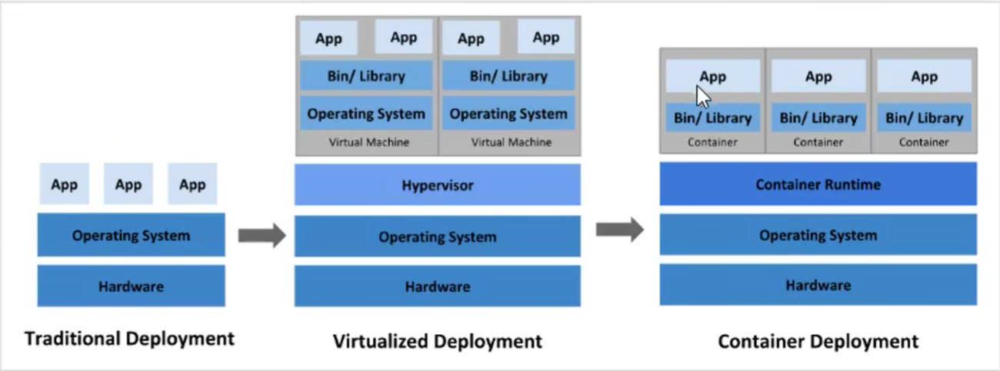
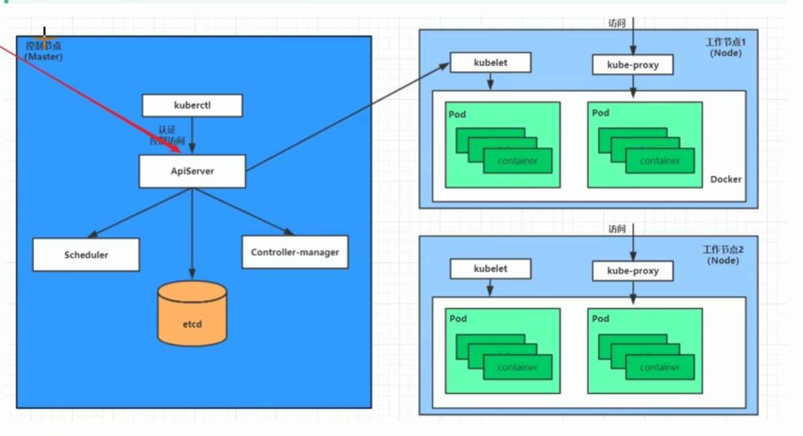
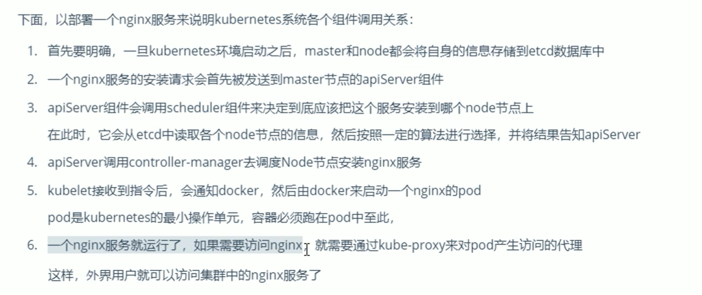
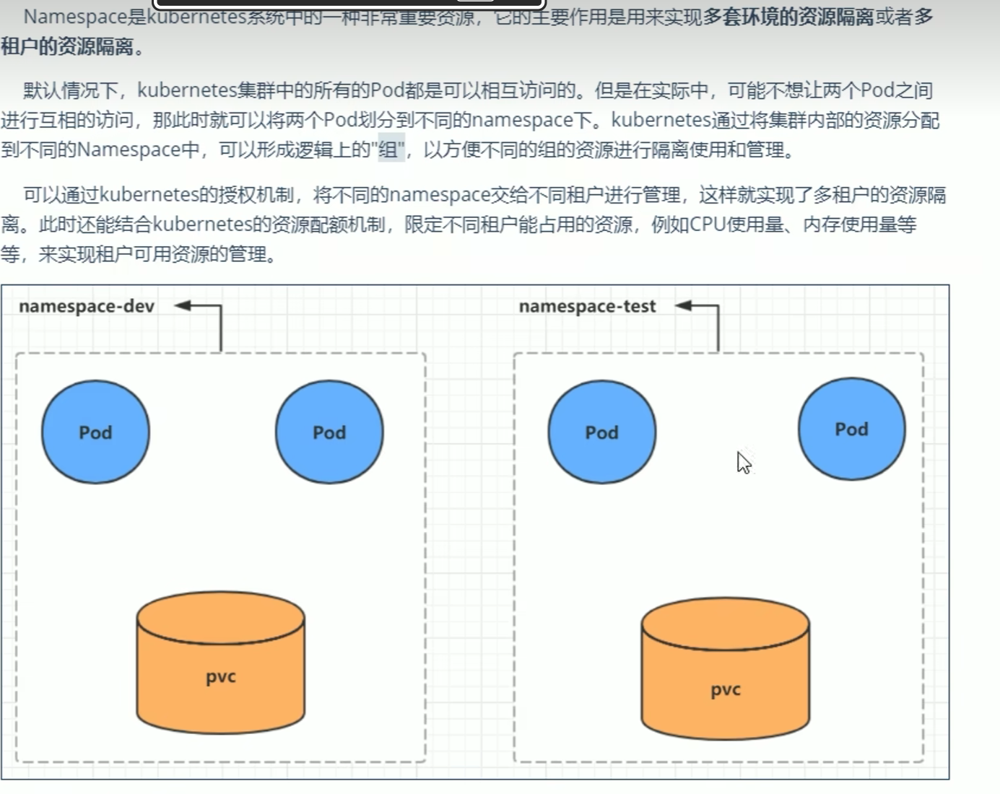
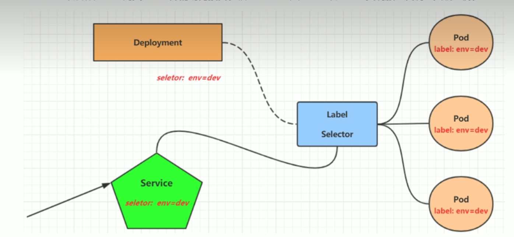

# 介绍
## 应用部署方式演变
* 传统部署
* 虚拟化部署
* 容器化部署
* 
* 容器编排问题：
  * 一个容器突然停止，如何让另一个容器立即启动去替补停机的容器
  * 当并发访问量变大的时候，如何做到横向扩展容器数量
## k8s是什么？
本质是一组服务器集群，在集群的每个节点上运行特定的程序，能够实现自动修复、弹性伸缩、服务发现、负载均衡、版本回退、存储编排的功能
## k8s的组成
* 控制节点+工作节点，每个节点上都安装不同的组件
* 
### 控制节点
* apiServer：控制的唯一访问入口，注意控制是指想要安装或者操作一个服务
* scheduler
* controllermanager
* etcd：存储集群中各种资源对象的信息
* kuberctl
### 工作节点：master分配容器到工作节点上，工作节点上的docker负责容器运行
* kubelet
* kube-proxy 
* docker
### 其他概念
pod：k8s的最小控制单元，容器都是运行在pod中的，一个pod中可以有一个或者多个容器、
controller：控制器，用来实现对pod的管理
service：pod对外服务的统一入口
label：标签，对pod进行分类
namespace：命名空间，用来隔离pod的运行环境
### 完整流程

# 集群环境搭建
## 环境规划
### 集群类型
* 一主多从
* 多主多从
# 资源管理
## 不同的管理方式
### 命令式对象管理
kubectl [命令] [指定资源类型] [指定资源的名称] [额外的参数]
### 命令式对象配置
* 命令+配置文件
kubectl [命令] -f [配置文件]
### 声明式对象配置
kubectl apply -f [配置文件]
* 用配置文件体现资源最终状态
* 如果存在相当于patch，更新，如果不存在相当于create创建
# 实战
## namespace
* 资源隔离的边界，可以将不同的资源隔离

### 增删查命令
## Pod
* k8s集群进行管理的最小单元，是容器的一种封装，容器必须位于pod中
* k8s的各个组件也都是用pod的方式运行的
* 注意，pod被其背后的控制器管理，如果想要删除pod，必须把其控制器一起删了，不然删除之后控制器又会创建一个
### 操作命令
## Label
* 和namespace的区别，同样也是分组，但不隔离，不影响通信
* 一个pod上可以有很多不同的标签
* labelselector用于查询和筛选拥有某些标签的资源对象，标签选择器可以同时使用多个
### 操作命令
* 增删改查
## deployment
* pod控制器的一种，用于管理pod，如果管理的pod不符合预期状态，比如停机了或者怎么样，会重建
* deployment上有标签选择器，deployment在创建pod的时候会给其添加标签，标签和选择器协同工作
### 作用
### 命令
kubectl  run deployment 参数
## service
* pod控制器重建pod之后，pod ip会随着pod的重建可变化，且这个ip是集群内部才能访问的虚拟ip
* k8s设计一个service作为pod对外的访问接口，service用来

* 和pod之间的关联也是通过标签选择器
### 操作命令及解释
* 集群内部可访问
* 集群外部可访问

