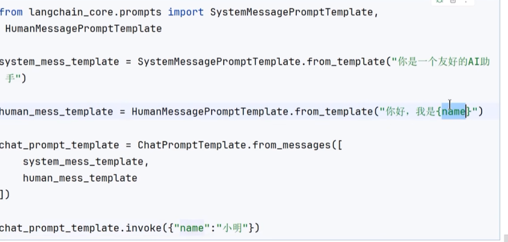
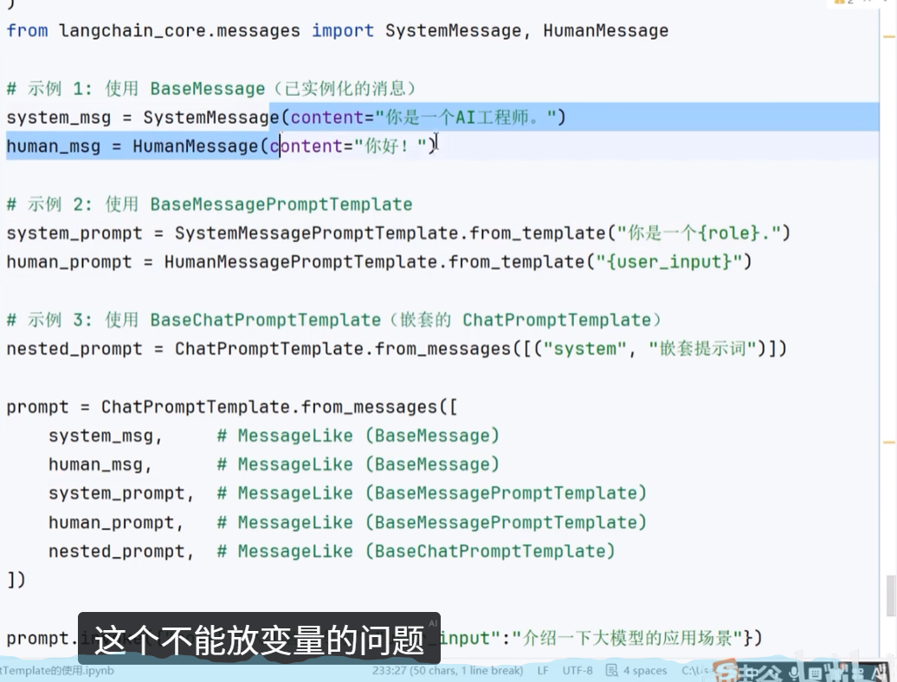
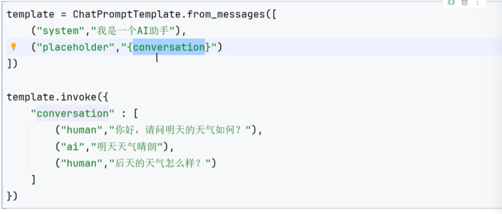
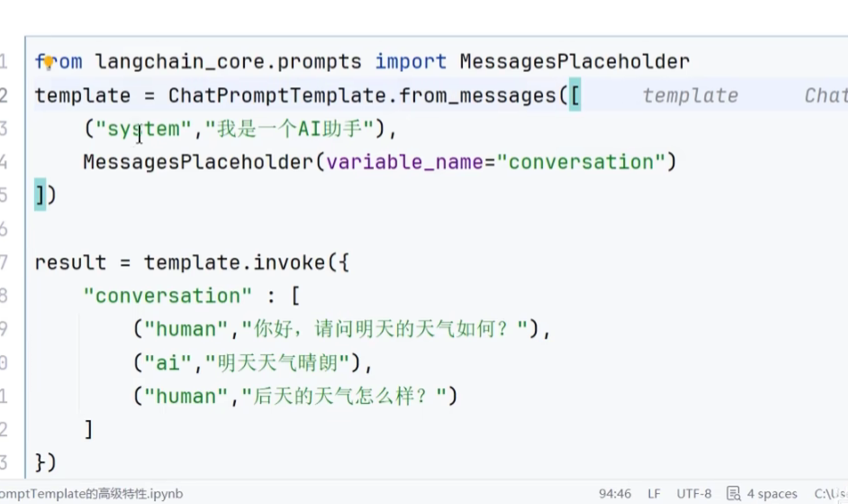
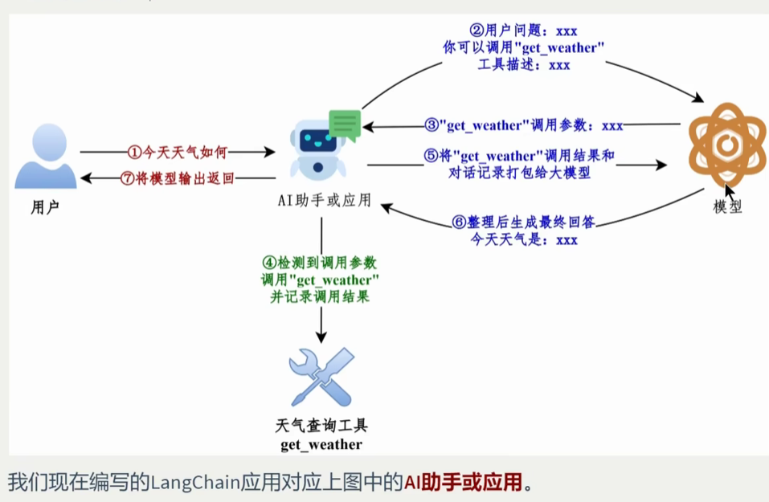

# 常见模型初始化参数
1. temperature：控制模型输出的随机化，值越大越随机
2. 客户端与连接：
   3. model_kwargs存放模型支持但是langchain没有直接列出来的字段
   4.extra_body:存放模型厂商基于openai api协议扩展的字段
4. 模型推理参数：
   temperature：控制模型输出的随机化，值越大越随机
4. 
# token是什么？
大模型通过分词器将文本拆分后的最小语义单元
# 模型的调用
* invoke、ainvoke
> responce = model.invoke(input,config)

其中config参数以dict形式存在，在调用模型的时候动态配置和控制模型的行为
，其和init模型的时候传入的那个一样，但如果在运行时显示传入，其会覆盖init中的内容
做到能对每个请求进行不同的配置
input可以直接是：1.直接输入文本2.列表，每个列表元素是一个字典
[{"role:"user","content":"具体的内容"},{}]
多轮对话场景如果不传递历史，ai会失忆
消息对象列表：SystemMessage对象、HumanMessage对象AssistantMessage对象
直接给一个存了对象的列表
返回值：AIMessage的对象

* stream
流式输出
* batch
一次性发送多个请求
* 异步方法：不用阻塞主线程，阻塞等待模型返回，加快效率
* 美化模型输出：pretty print
* model.profile有的可能可以查看模型配置
# 消息和提示词模板
## 消息的类型
langchain中消息类型通过role区分，也就是我们传给模型的那个信息里的role
system，为模型设定角色，user：表示用户的输入，assistant：表示大模型的回复，tool：工具调用消息
## 消息格式
* json
* 对象
  * 对象字段：content：即输入给模型的内容
    * content还可以保存多模态的数据，每一块标明text和type，使用字典类型
    * content_blocks:是一个字典的列表，可以替代原来的contnt字段对输入进行格式化，
    * 同时也可以对我们的输出进行格式化，统一输出格式
    * 直接就是respond.content_blocks,其是懒加载的，被调用后才会被解析
  *       metadata：元数据字段，自己随便定义，对消息进行分组，但并不是所有模型/模型供应商都支持
  * toolMessage：有一个tool_call_id
# 实战
## 对话历史管理
每次将回复append到输入中
# langsmith的基本使用

## tracing
# 提示词模板
ChatPromptTemplate
## 实例化
c = ChatPromptTemplate.from_messages([(),(),()])实例化一个模板出来
c.invoke() 
c.format() 返回的是字符串
c.format_messages() 返回的是消息列表
以上三种是根据模板来填充其中字段，得到最终输入给图形的东西
注意消息对象的方式，就不能在模板中声明变量
* BaseMessagePromptTemplate参数列表
* BaseChatPromptTemplate参数列表：意思就是ChatPromptTemplate.from_messages
* 传入的参数列表中的单个元素仍然可以是一个ChatPromptTemplate类型的
* 总的例子
* partial()部分变量预填充，可以先填充模板的部分字段，用法：
> c.partial(name="")
* 消息占位符
  * placeholder
  * messagePlaceholder 
  * 实际开发中会单独维护一个提示词模板文件，这个文件被人引用比如：
# 工具
* 明确指定了输入和输出的可调用函数
* name.invoke({})
* @tool标注
* model.bind_tools([工具名])
## 调用整体流程

注意，工具是我们的agent来调用，请求来自大模型，我们在应用中调用，调用完把结果append
在message（toolmessage类型）里再传给模型
## 工具的定义
### 不使用@tool
声明函数，将函数绑定在模型上
#### convert_to_openai_tool
#### description说明,python本来就有的
说明
Args:
Returns:
* 参数类型的说明
### 使用@tool
* 标识当前函数是一个工具
* @tool(description="")
* @tool(parse_docstring=)
* 自定义args_schema:继承BaseModel
  * Field(description=,default=)标注一个字段
  * Literal，限制参数自能从固定的一部分值里面取
  * 第二种方式，用json schema，直接传一个json的数据
* 多工具调用：大模型的response中tool_calls字段不止一个
    * 案例：
* tool_choice:配置是否强制大模型调用工具，auto，required，none，具体的方法
* 实践经验：清晰的描述，功能单一，处理工具失败，最好直接返回字符串，同步和异步
### 有很多内置的工具，可以直接用
# 结构化输出
## Pydantic结构化
class a(BaseModel):
    """
      工具的描述
    """
## TypedDisct
## JSON Schema
## 数据类
# 智能体
* 统一为create_agent(),将大模型、工具、prompt等传入，来创建一个智能体
* 模型的传入方式：1.传入一个字符串，类似之前模型的创建，注意要加load_dovenv2.直接先创建一个模型，然后传入模型实例
* 调用：agent.invoke(),传入的是消息列表，返回的也是字典包含的消息列表，和模型调用好像是一样的
例子：
* 绑定工具：静态 or 借助中间件动态
* 1.静态：创建的时候传入tools=[ , , ,]
## 工具调用流程分析
ReAct结构 思考-行动-观察
* 设置agent名字：传入name=
## 结构化输出
1.ProviderStrategy原生的结构化输出
2.ToolStrategy不支持原生结构化输出的模型，相当于创建一个虚拟工具，这个工具引导模型产生对应结构的输出
### ToolStrategy详解
三个参数:schema：对应之前讲的四种结构化输出，表明用哪一种；Union(),提供多个结构化类，对应不同的问题可以选用
tool_message_content:设置显示在ToolMessage中content上的数据，因为实际的大模型使用的数据其实不依靠contnt，可以节省token
handle_errors：默认为true，捕获所有异常，false：关闭自动重试，直接抛出异常
设定为指定异常类型：捕获这种异常，有：multiplestructuredoutputserror，structuredoutputvalidationerror
设定为指定的错误处理函数：直接把函数给handle_errors参数
设定为自定义字符串：
## 流式输出及模式
agent.stream()调用，stream_mode参数控制
values：每步都会输出完整的状态信息等
updates：默认使用，只增量更新状态中发生变化的内容
messages：会输出流式返回的token已经相关的元数据
tasks：输出当前任务开始时间，结束时间等
debug:
custom:
# 中间件
添加一些钩子函数，在真实的业务场景之中优化，处理一些不属于核心业务逻辑但是会影响执行过程的问题
## 常用内置中间件及其使用
### 成本与资源控制类
model call limit等
### 稳定性与容错保障
### 安全与合规风控
### 决策增强与智能编排
### 执行能力扩展
### 开发调试与测试辅助
## 多个中间件组合及执行顺序
* 书写顺序和执行顺序有关
## 自定义中间件
* 钩子函数在某个特定流程，被框架系统或者主流程自动调用的扩展函数，定义中间件实际上就是创建对应函数
* 参数state runtime 是谁传入的？
### 基于装饰器的实现

###
# 上下文与记忆
# RAG
# MCP与skills
### 基本用法

模板让提示词可以复用，支持变量填充。

```python
from langchain_core.prompts import ChatPromptTemplate

# 定义模板
prompt = ChatPromptTemplate.from_messages([
    ("system", "你是一个{language}专家，请用简洁的方式回答问题"),
    ("human", "{question}"),
])

# 填充变量 → 得到消息列表
messages = prompt.invoke({"language": "Python", "question": "什么是装饰器？"})

# 与模型组合（LCEL 链）
chain = prompt | model
response = chain.invoke({"language": "Python", "question": "什么是装饰器？"})
```

### 三种调用方法

```python
prompt.invoke({"var": "value"})          # 返回 ChatPromptValue（可直接传给模型）
prompt.format({"var": "value"})          # 返回字符串
prompt.format_messages({"var": "value"}) # 返回消息对象列表
```

### 传入消息对象（不使用变量）

```python
# 直接传消息对象时，不能在模板中使用变量
prompt = ChatPromptTemplate.from_messages([
    SystemMessage("你是专家"),
    HumanMessage("{question}"),  # ❌ 这样写变量无效，因为是对象不是元组
])

# ✅ 正确：用元组 (role, "模板字符串") 才支持变量
prompt = ChatPromptTemplate.from_messages([
    ("system", "你是专家"),
    ("human", "{question}"),    # ✅ 元组形式支持变量
])
```

### 部分变量预填充（partial）

```python
# 先填充固定变量，生成新模板
partial_prompt = prompt.partial(language="Python")

# 使用时只需传剩余变量
chain = partial_prompt | model
chain.invoke({"question": "什么是 GIL？"})
```

### 消息占位符（MessagesPlaceholder）

用于在模板中插入动态的消息列表（如对话历史）：

```python
from langchain_core.prompts import MessagesPlaceholder

prompt = ChatPromptTemplate.from_messages([
    ("system", "你是一个助手"),
    MessagesPlaceholder("history"),   # 这里插入历史消息列表
    ("human", "{question}"),
])

chain = prompt | model
chain.invoke({
    "history": [
        HumanMessage("我叫张三"),
        AIMessage("你好，张三！"),
    ],
    "question": "我叫什么名字？"
})
```

---

## 六、LCEL（LangChain Expression Language）

用 `|` 管道符把组件串联，形成"链"：

```python
chain = prompt | model | output_parser
result = chain.invoke({"question": "..."})
```

每个组件都实现了 `Runnable` 接口，支持 invoke / stream / batch / ainvoke 等方法，链整体也支持这些方法。

```python
# 流式输出整个链
for chunk in chain.stream({"question": "讲个故事"}):
    print(chunk, end="", flush=True)

# 批量调用链
results = chain.batch([{"question": "Q1"}, {"question": "Q2"}])
```

---

## 七、LangSmith（可观测性平台）

LangSmith 是 LangChain 官方的追踪平台，记录每次调用的输入/输出/token 消耗/耗时。

```python
import os
os.environ["LANGCHAIN_TRACING_V2"] = "true"
os.environ["LANGCHAIN_API_KEY"] = "ls__..."
os.environ["LANGCHAIN_PROJECT"] = "my-project"   # 项目名称

# 之后的所有 LangChain 调用会自动上报到 LangSmith
```

登录 `smith.langchain.com` 即可查看调用链路图，适合调试复杂 Agent。

---

## 八、工具（Tools）

工具是"明确指定了输入和输出的可调用函数"，让模型可以调用外部能力（搜索、计算、数据库查询等）。

### 定义工具

**方法一：@tool 装饰器（推荐）**

```python
from langchain_core.tools import tool
from pydantic import BaseModel, Field
from typing import Literal

# 简单写法：docstring 自动成为 description
@tool
def get_weather(city: str) -> str:
    """查询指定城市的天气。city: 城市名称（中文）"""
    return f"{city}今天天气晴，气温25度"

# 复杂写法：自定义参数 schema
class SearchInput(BaseModel):
    query: str = Field(description="搜索关键词")
    max_results: int = Field(default=5, description="最大返回条数")
    category: Literal["新闻", "技术", "生活"] = Field(description="搜索分类")

@tool(args_schema=SearchInput)
def search(query: str, max_results: int = 5, category: str = "新闻") -> str:
    """在互联网上搜索信息"""
    return f"搜索 '{query}' 的前{max_results}条{category}结果..."
```

**方法二：不用装饰器**

```python
from langchain_core.tools import StructuredTool

def add(a: int, b: int) -> int:
    """把两个数相加"""
    return a + b

tool = StructuredTool.from_function(add)
```

### 绑定工具到模型

```python
model_with_tools = model.bind_tools([get_weather, search])

response = model_with_tools.invoke("北京今天天气怎么样？")
# response.tool_calls 包含模型决定调用的工具信息
print(response.tool_calls)
# [{"name": "get_weather", "args": {"city": "北京"}, "id": "call_xxx"}]
```

### 完整工具调用流程

```python
from langchain_core.messages import ToolMessage

# 1. 模型决定调用哪些工具
response = model_with_tools.invoke(messages)

# 2. 我们在应用层执行工具
if response.tool_calls:
    for tool_call in response.tool_calls:
        tool_name = tool_call["name"]
        tool_args = tool_call["args"]
        tool_result = tools_map[tool_name].invoke(tool_args)
        
        # 3. 把工具结果封装成 ToolMessage 追加到消息历史
        messages.append(response)  # AIMessage（含 tool_calls）
        messages.append(ToolMessage(
            content=str(tool_result),
            tool_call_id=tool_call["id"]
        ))

# 4. 再次调用模型，得到最终回答
final_response = model_with_tools.invoke(messages)
```

### 工具配置参数

```python
model_with_tools = model.bind_tools(
    tools=[get_weather, search],
    tool_choice="auto",     # auto（模型自己决定）/ required（必须调用）/ none（不调用）
    # 也可以指定工具名：tool_choice={"type": "function", "function": {"name": "get_weather"}}
)
```

### 多工具并行调用

模型可以在一次回复中调用多个工具：

```python
response.tool_calls  # 可能包含多个 tool_call 对象
# 需要对每个都执行并追加 ToolMessage
```

### 实践建议

- 工具 description 要清晰准确，直接影响模型的工具选择
- 工具应功能单一，一个工具只做一件事
- 工具最好返回字符串（方便模型读取）
- 处理工具调用失败，返回错误信息而非抛出异常
- 同步函数和异步函数都可以，对应 invoke 和 ainvoke

---

## 九、结构化输出

让模型按照指定 schema 输出 JSON，而非自由文本。

```python
from pydantic import BaseModel, Field

class MovieReview(BaseModel):
    title: str = Field(description="电影名称")
    rating: float = Field(description="评分，1-10分", ge=1, le=10)
    summary: str = Field(description="简短评价，50字以内")
    recommend: bool = Field(description="是否推荐观看")

# 方式一：with_structured_output（推荐，自动处理解析）
structured_model = model.with_structured_output(MovieReview)
result = structured_model.invoke("评价一下《流浪地球》")
print(result.title)    # 访问结构化字段
print(result.rating)

# 方式二：输出解析器
from langchain_core.output_parsers import JsonOutputParser

parser = JsonOutputParser(pydantic_object=MovieReview)
chain = prompt | model | parser
result = chain.invoke({"movie": "流浪地球"})
```

---

## 十、智能体（Agent）

Agent = 让模型自主决策"调用哪些工具、调用几次、以什么顺序"，直到得到最终答案。

### ReAct Agent（最常用模式）

ReAct = **Re**asoning + **Act**ing：模型交替进行推理（思考做什么）和行动（调用工具）。

```python
from langchain.agents import create_react_agent, AgentExecutor
from langchain import hub

# 使用官方 ReAct 提示词模板
prompt = hub.pull("hwchase17/react")

# 创建 agent
agent = create_react_agent(model, tools=[search, get_weather], prompt=prompt)

# AgentExecutor 处理循环调用
executor = AgentExecutor(agent=agent, tools=[search, get_weather], verbose=True)

result = executor.invoke({"input": "北京今天天气如何？搜索相关新闻"})
print(result["output"])
```

### Tool Calling Agent（更简洁，推荐）

```python
from langchain.agents import create_tool_calling_agent, AgentExecutor

prompt = ChatPromptTemplate.from_messages([
    ("system", "你是一个有用的助手"),
    MessagesPlaceholder("chat_history", optional=True),
    ("human", "{input}"),
    MessagesPlaceholder("agent_scratchpad"),  # Agent 的中间步骤
])

agent = create_tool_calling_agent(model, tools, prompt)
executor = AgentExecutor(agent=agent, tools=tools, verbose=True, max_iterations=5)

result = executor.invoke({"input": "帮我查询今天北京的天气"})
```

---

## 十一、对话历史与记忆管理

### 手动管理（最可控）

```python
from langchain_core.chat_history import InMemoryChatMessageHistory

history = InMemoryChatMessageHistory()

def chat(user_input: str) -> str:
    history.add_user_message(user_input)
    response = model.invoke(history.messages)
    history.add_ai_message(response.content)
    return response.content
```

### RunnableWithMessageHistory（自动管理）

```python
from langchain_core.runnables.history import RunnableWithMessageHistory

chain = prompt | model

chain_with_history = RunnableWithMessageHistory(
    chain,
    get_session_history=lambda session_id: InMemoryChatMessageHistory(),
    input_messages_key="question",
    history_messages_key="history",
)

# 通过 configurable session_id 区分不同用户的会话
chain_with_history.invoke(
    {"question": "我叫张三"},
    config={"configurable": {"session_id": "user_001"}}
)
chain_with_history.invoke(
    {"question": "我叫什么名字？"},
    config={"configurable": {"session_id": "user_001"}}  # 同一 session 能记住历史
)
```

---

## 十二、RAG（检索增强生成）

RAG = **R**etrieval **A**ugmented **G**eneration，让模型基于你的私有文档回答问题。

### 核心流程

```
原始文档 → 分块（Chunking）→ 向量化（Embedding）→ 存入向量数据库
                                                           ↓
用户提问 → 向量化 → 相似度检索（召回Top-K相关块）→ 拼入Prompt → 模型生成答案
```

### 代码示例

```python
from langchain_community.document_loaders import TextLoader
from langchain.text_splitter import RecursiveCharacterTextSplitter
from langchain_openai import OpenAIEmbeddings
from langchain_community.vectorstores import Chroma
from langchain.chains import RetrievalQA

# 1. 加载文档
loader = TextLoader("document.txt", encoding="utf-8")
docs = loader.load()

# 2. 文档分块
splitter = RecursiveCharacterTextSplitter(chunk_size=500, chunk_overlap=50)
chunks = splitter.split_documents(docs)

# 3. 向量化并存入向量数据库
embedding = OpenAIEmbeddings()
vectorstore = Chroma.from_documents(chunks, embedding, persist_directory="./chroma_db")

# 4. 构建检索链
retriever = vectorstore.as_retriever(search_kwargs={"k": 3})  # 召回前3个最相关块
qa_chain = RetrievalQA.from_chain_type(llm=model, retriever=retriever)

# 5. 问答
answer = qa_chain.invoke({"query": "文档里说了什么？"})
print(answer["result"])
```

---

## 十三、MCP（Model Context Protocol）

MCP 是 Anthropic 提出的开放协议，让 AI 应用能以标准化方式连接外部数据源和工具。

**概念类比**：MCP 之于 AI 应用，就像 USB 之于硬件——统一接口，任意设备即插即用。

### MCP vs LangChain Tools 对比

| 对比项 | LangChain Tools | MCP Tools |
|--------|----------------|-----------|
| 实现位置 | 在应用内部定义 | 独立服务（MCP Server）|
| 跨应用复用 | 需要手动复制代码 | 任意 MCP 客户端都能调用 |
| 生态 | LangChain 生态内 | 跨框架、跨语言 |
| 适用场景 | 应用内部工具 | 需要共享的基础能力 |

### 在 LangChain 中使用 MCP 工具

```python
from langchain_mcp_adapters.client import MultiServerMCPClient

# 连接 MCP 服务器
async with MultiServerMCPClient({
    "filesystem": {
        "command": "npx",
        "args": ["-y", "@modelcontextprotocol/server-filesystem", "/path/to/dir"],
        "transport": "stdio"
    }
}) as client:
    tools = client.get_tools()           # 获取 MCP 服务器暴露的工具
    model_with_tools = model.bind_tools(tools)  # 绑定到模型
    response = await model_with_tools.ainvoke("列出当前目录的文件")
```

---

## 十四、关键概念速查

| 概念 | 说明 |
|------|------|
| `ChatModel` | 接受消息列表，返回 AIMessage 的模型接口 |
| `Runnable` | LangChain 所有组件的基类，支持 invoke/stream/batch |
| `LCEL` | 用 `\|` 把 Runnable 串联成链的语法 |
| `ChatPromptTemplate` | 带变量占位符的提示词模板 |
| `MessagesPlaceholder` | 在模板中插入消息列表的占位符 |
| `tool` | 装饰器，把函数变成模型可调用的工具 |
| `with_structured_output` | 让模型按 Pydantic schema 输出结构化数据 |
| `AgentExecutor` | 执行 Agent 循环（模型 → 工具 → 模型 → ...）的运行器 |
| `RAG` | 检索增强生成，让模型基于私有文档回答 |
| `Embedding` | 把文本转换为向量（数字数组），用于相似度检索 |
| `Vector Store` | 存储和检索向量的数据库（Chroma、Pinecone、FAISS等）|
| `MCP` | 标准化工具协议，让 AI 应用跨框架复用工具 |
