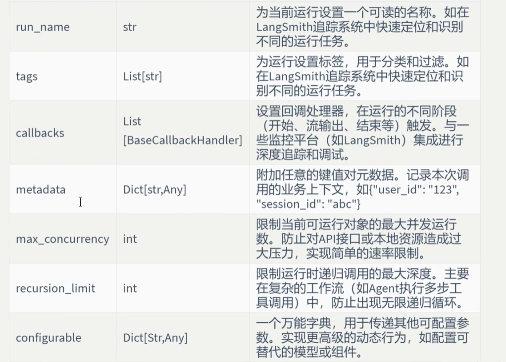
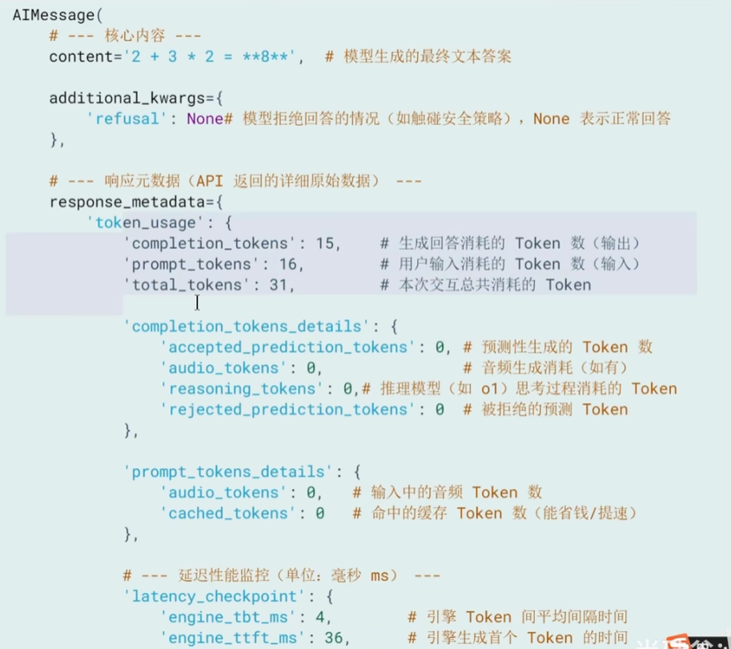
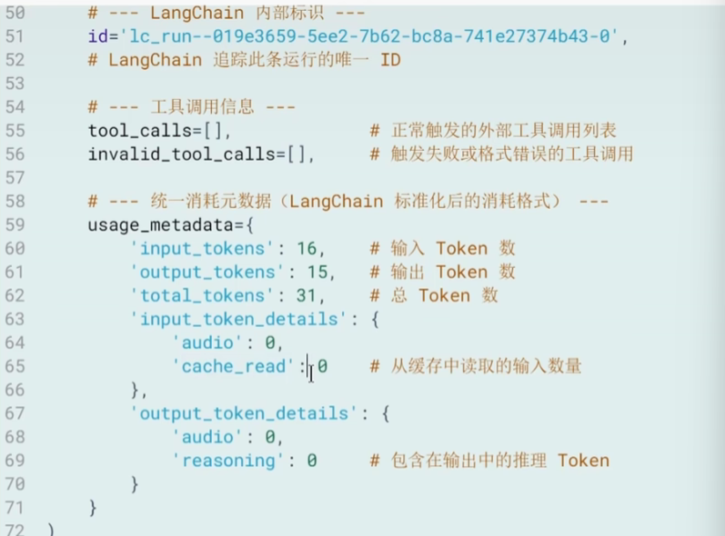
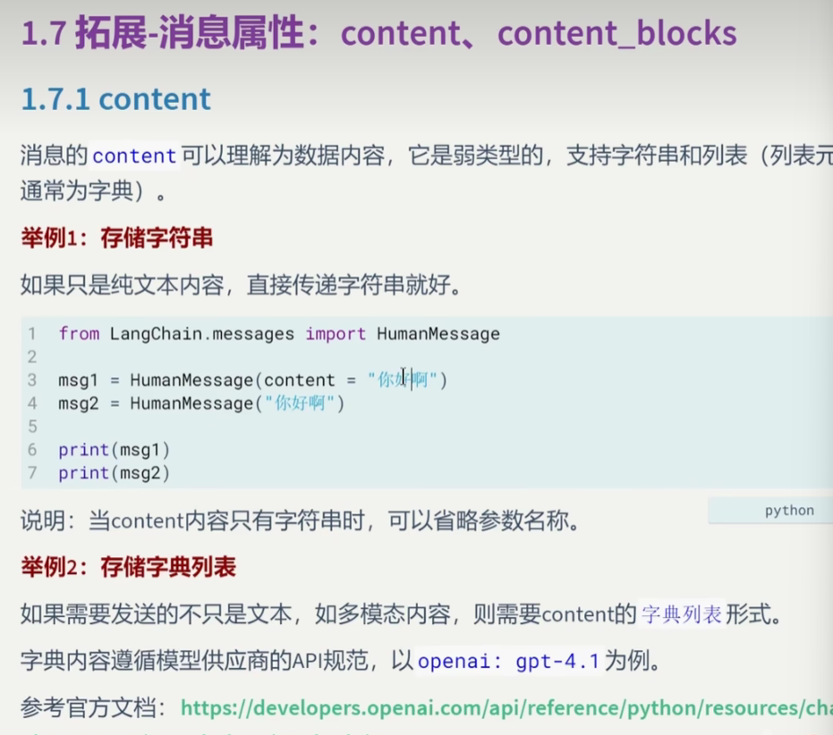
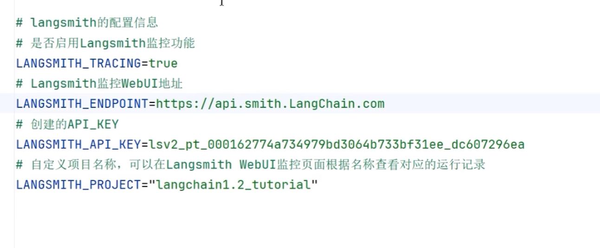

# 常见模型初始化参数
1. temperature：控制模型输出的随机化，值越大越随机
2. 客户端与连接：
   3. model_kwargs存放模型支持但是langchain没有直接列出来的字段
   4.extra_body:存放模型厂商基于openai api协议扩展的字段
4. 模型推理参数：
   temperature：控制模型输出的随机化，值越大越随机
4. 
# token是什么？
大模型通过分词器将文本拆分后的最小语义单元
# 模型的调用
* invoke、ainvoke
> responce = model.invoke(input,config)

其中config参数以dict形式存在，在调用模型的时候动态配置和控制模型的行为
，其和init模型的时候传入的那个一样，但如果在运行时显示传入，其会覆盖init中的内容
做到能对每个请求进行不同的配置
input可以直接是：1.直接输入文本2.列表，每个列表元素是一个字典
[{"role:"user","content":"具体的内容"},{}]
多轮对话场景如果不传递历史，ai会失忆
消息对象列表：SystemMessage对象、HumanMessage对象AssistantMessage对象
直接给一个存了对象的列表
返回值：AIMessage的对象

* stream
流式输出
* batch
一次性发送多个请求
* 异步方法：不用阻塞主线程，阻塞等待模型返回，加快效率
* 美化模型输出：pretty print
* model.profile有的可能可以查看模型配置
# 消息和提示词模板
## 消息的类型
langchain中消息类型通过role区分，也就是我们传给模型的那个信息里的role
system，为模型设定角色，user：表示用户的输入，assistant：表示大模型的回复，tool：工具调用消息
## 消息格式
* json
* 对象
  * 对象字段：content：即输入给模型的内容
    * content还可以保存多模态的数据，每一块标明text和type，使用字典类型
    * content_blocks:是一个字典的列表，可以替代原来的contnt字段对输入进行格式化，
    * 同时也可以对我们的输出进行格式化，统一输出格式
    * 直接就是respond.content_blocks,其是懒加载的，被调用后才会被解析
  *       metadata：元数据字段，自己随便定义，对消息进行分组，但并不是所有模型/模型供应商都支持
  * toolMessage：有一个tool_call_id
# 实战
## 对话历史管理
每次将回复append到输入中
# langsmith的基本使用

## tracing
# 提示词模板
ChatPromptTemplate
## 实例化
c = ChatPromptTemplate.from_messages([(),(),()])实例化一个模板出来
c.invoke() 
c.format() 返回的是字符串
c.format_messages() 返回的是消息列表
以上三种是根据模板来填充其中字段，得到最终输入给图形的东西
注意消息对象的方式，就不能在模板中声明变量
* BaseMessagePromptTemplate参数列表