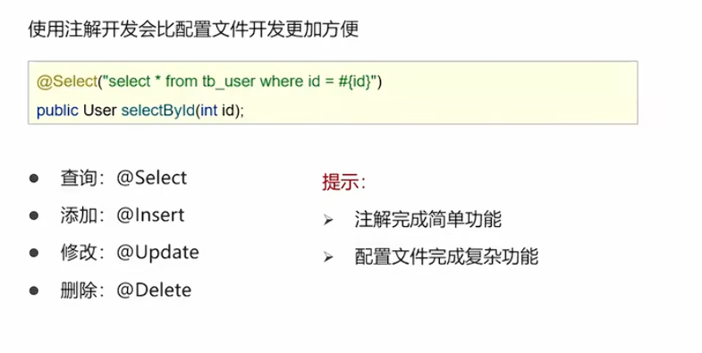
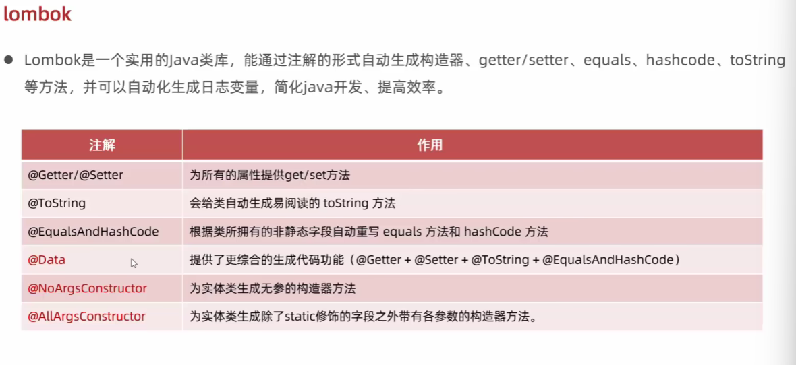
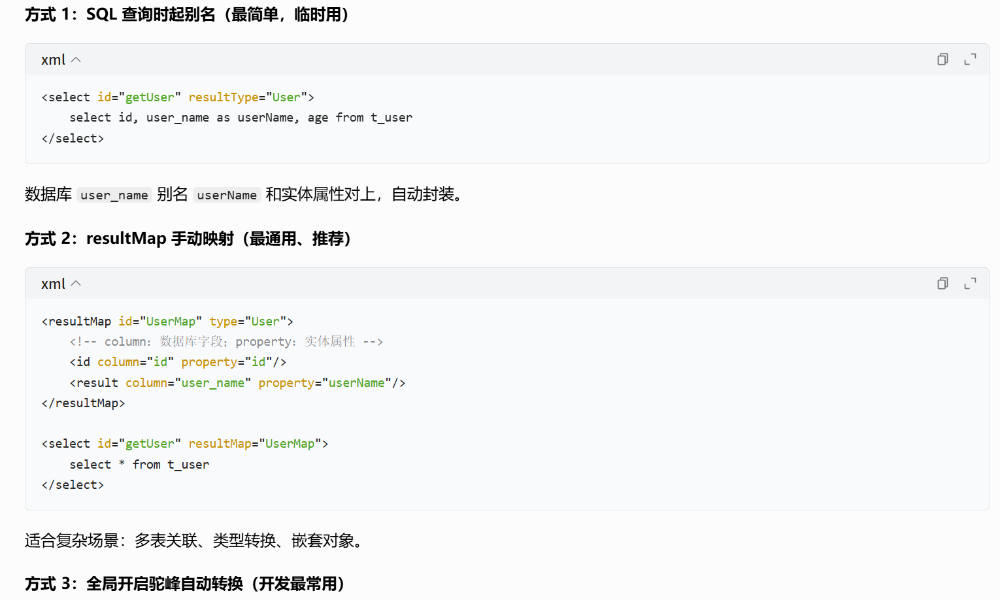
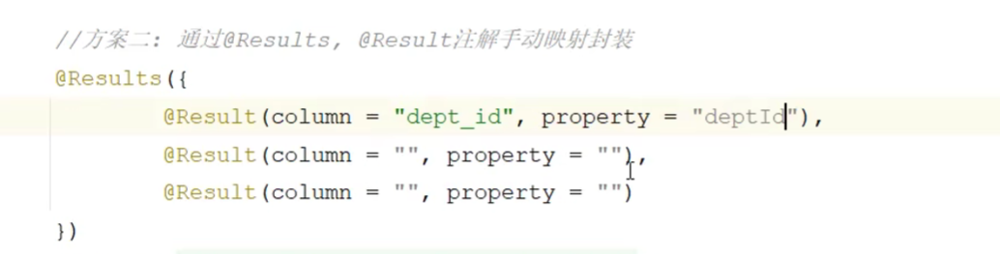
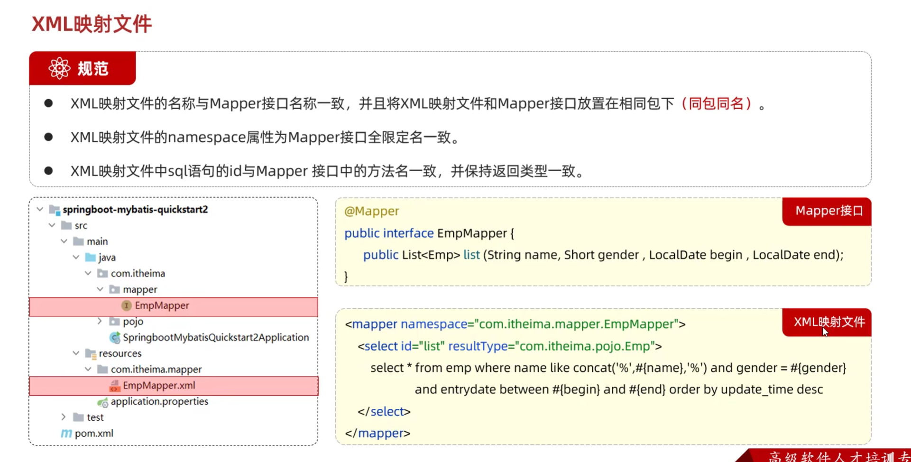
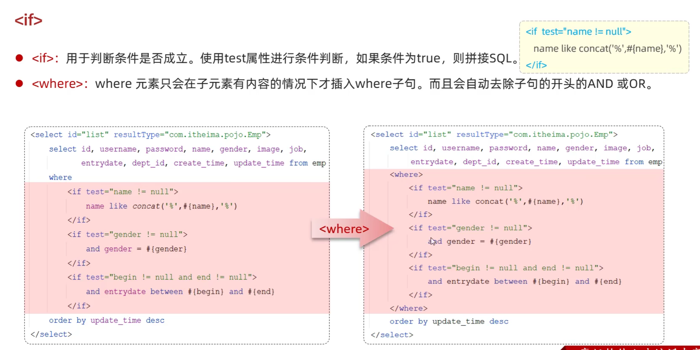
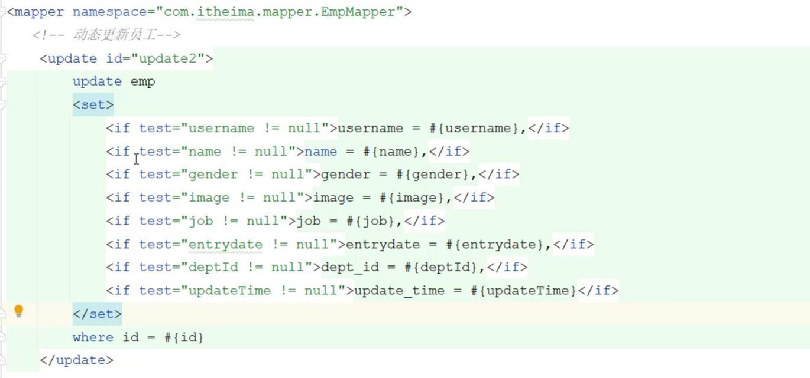
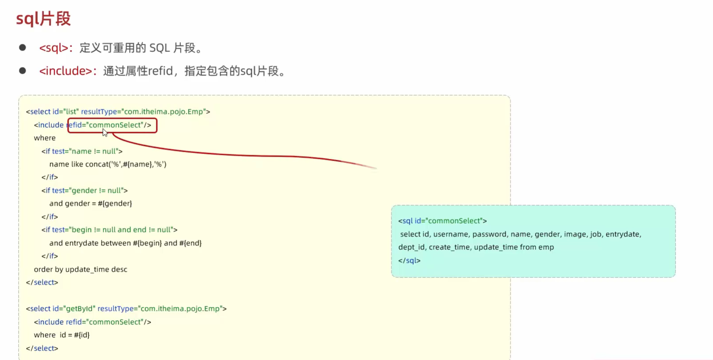

* 核心目的是为了简化JDBC的开发，是一款持久层框架
* 持久层：JavaEE一共有三层结构：表现层（页面展示）、业务层（逻辑处理）、持久层，持久层负责将数据保存到数据库（也就死DAO）
* JDBC就是java提供的和数据库交互的方式，Mybatis做了一些封装，将开发变得更加简单
* 注意，可以用注解进行注释，但是简单的用注解，复杂的最终还是应该用xml

# 原生mybatis(即没有被Spring、Springboot集成)
## 流程
* 给每个要操作的表格创造对应的类
* 创造mybatis的配置xml文件(连接数据库相关，加载mapper的配置文件,也是一个单独的xml)，mybatis-config.xml（主配置文件）
* 创建sql语句映射配置文件*Mapper.xml(名字不固定，在mybatis-config.xml中引入就行)，给每个sql操作绑定一个id
* 读配置xml文件，创建SqlSessionFactory实例
* 用SqlSessionFactory.build(resourse)获取SqlSession对象
* 利用SqlSession来执行配置好的sql语句
> SqlSession.*.(id)
## 让idel知道数据库
可以在maven中配置一下数据库信息，这样就能在编程的时候让idel认识数据库了
## Mapper
* Mapper注解标明这里面替代xml里的mapper
* 让SqlSession.*.(id)的硬编码变成用一个Mapper接口来实现函数的方式，注意是一个接口，里面并不需要实现方法，因为实际上执行的是sql语句
* mapper接口和mapper对应的xml文件需要在同一个路径下
* mapper xml文件格式

* 执行语句变成了获取mapper对象再执行函数

## 核心配置文件

<configuration>
    <environments> 用于配置不同的环境
    
     
    <environments>

## 配置文件完成增删改查
* 编写mapper接口里面的接口方法
* 在mapper配置文件里配置对应的sql语句
* 数据库表的名称要和实体类的名称能够对应（此处是为了可以自动封装返回值）
> 1.起别名，将别名对应一样

> 2.用resultMap将其映射为一样
* 如何接收参数？
> 利用参数占位符${#}和$.${#{}}是将字段变成？,${}是直接拼接在sql语句里

>散装多个参数，需要在类里面用@Param(name)来进行标注

>对象参数* public List<Brand> selectAll(Brand);这个需要先映射为名称一样

>用Map集合对应名称就可以了
* 动态条件查询：sql语句随着用户的输入变化
> <if test="  !=null" > </if> 使用if标签，满足判断才会拼上去

>choose标签从很多个条件中选择一个，只会有一个
### 查询数据
* 查询Brand
* public List<Brand> selectAll();
## 对参数的封装
* 如果有多个参数传递给方法，mybatis会将这些参数封装为一个map集合，如果用@Param()，标注了的话，就会把map里对应的名字替换掉，这也是为什么在sql语句里用对应名称能够取到值的原因


# springboot整合mybatis
## JDBC
* jdbc是java语言定制的一套操控数据库的规范，各个数据库厂商需要根据这个规范（接口）
来提供java中操纵数据库的实现，也被称为驱动，每个数据库提供的驱动不一样，这也就是为什么我们开始要配置驱动
* 原始的jdbc程序开发较为繁琐，开发效率低，mybatis为了解决这个问题被提出，相当于封装了一下让开发变得更简单了
## 数据库连接池
* 一个负责分配和管理数据库连接的容器，允许应用程序重复使用一个现有的数据库连接
以及释放很久没有用的连接
## lombok
* 能通过简单的注解自动生成构造器，getter/setter方法，加快开发速度
* 
## mybatis使用
### 表的映射
1. 需要操作的表在java中要有一个对应的实体类
2. 默认的自动映射需要库字段和实体类里面的属性名完全一模一样
如果不一样那么有两种手动映射的方式
### 什么是Mapper？Mapper的作用
* Mapper是一个映射器，把 Java 代码 和 SQL 语句做映射绑定。
#### Mapper的结构
##### Mapper 接口（Java 文件，`.java`）
```java
public interface UserMapper {
    User selectById(Long id);
    int insert(User user);
}
```
- 只定义**方法名、入参、返回值**，没有方法实现；
- 每一个方法对应一条 SQL；
- 相当于一套数据库操作的**方法规范**。

##### Mapper XML 文件（`.xml`）或者直接通过注解
* 同一个方法：注解 SQL 和 XML SQL 只能存在一个，但同一个Mapper的不同方法可以一部分注解、一部分 XML，混用合法。
```xml
<mapper namespace="com.mapper.UserMapper">
    <select id="selectById" resultType="User">
        select * from user where id = #{id}
    </select>
</mapper>
```
```java
        public interface UserMapper {
        @Select("select * from user where id=#{id}")
        User selectById(Long id);
        }
```
- `namespace` 绑定上面的 Java 接口全类名；
- `id` 和接口方法名一一对应；
- 里面写真实执行的 SQL；
- 是 SQL 的存放载体。

#### mapper的使用
* 如何传参构造动态的sql语句：1.在声明的方法写上对应参数名2.在sql语句中用#{参数名}来代指传入的参数
* 预编译：在真正执行的时候#{}会被替换为？，然后将输入的参数替换？得到最终的语句
>性能更高 预编译的？在只有参数不一样的时候只有编译一次
> 一、核心原理：SQL 分两步执行
普通拼接 SQL（Statement）执行流程：
把完整 SQL 字符串发给数据库
数据库语法解析 → 语义校验 → 生成最优执行计划 → 执行
返回结果
预编译 SQL 流程：
发送模板 select * from user where id = ?
数据库解析、生成执行计划并缓存
后续只传参数值，直接复用缓存好的执行计划，跳过解析优化阶段
性能关键点：解析 + 生成执行计划很耗 CPU
数据库要做：词法分析、语法树、校验表 / 字段权限、索引选择、多表连接优化。
复杂查询（多表 join、子查询、聚合）的优化耗时远大于真正查询数据。
频繁重复执行同类 SQL 时，预编译只做一次解析优化。
> 更加安全，比直接拼接的方式更可以防止sql注入
* 增加和查询操作，传给方法以及返回接收到的参数是对应的实体类，在增加操作的时候依然还是用#{实体类中的属性名}来代替值
* 主键返回：在数据添加成功之后需要获取刚才添加的这条数据在表中的主键，在方法上添加
Options(KeyProperty=“字段名”,useGeneratedKeys=true)的注解，就可以在添加完成之后自动将主键填写到当时传入的那个对象的对应字段中

* 动态sql


MyBatis Mapper相关知识点完整总结（结合你全部提问：@Mapper、@MapperScan、共存、归属、底层、IDE报错）

一、两个核心注解基础归属

1. @Mapper

- 来源：mybatis 核心包  org.apache.ibatis.annotations.Mapper ，是MyBatis原生注解，和Spring无关。
- 作用粒度：单个Mapper接口，标记当前接口为MyBatis映射接口。
- 生效前提：必须引入  mybatis-spring  整合包，依靠整合包的后置处理器识别注解，生成代理对象并放入Spring容器。

2. @MapperScan / MapperScannerConfigurer

- 来源：mybatis-spring 整合包，不属于原生MyBatis，也不属于Spring框架原生注解。
- 误区纠正：@MapperScan 不是SpringBoot专属，传统SSM（Spring+SpringMVC）JavaConfig配置类中同样可以使用；SpringBoot只是简化依赖与自动配置，并没有创造这个注解。
- 作用粒度：包级批量扫描，指定根路径，自动将包下所有符合规则的Mapper接口批量注册为Spring Bean。
- 底层入口： @MapperScan  通过 @Import(MapperScannerRegistrar) ，最终注册 MapperScannerConfigurer （BeanDefinitionRegistryPostProcessor），批量生成 MapperFactoryBean 。

二、三种使用方式对比

方式1：仅使用 @Mapper（逐个标记）

1. 在每个DAO接口上加 @Mapper ；
2. 运行时通过后置处理器识别注解，逐个生成Mapper代理对象；
3. 问题：编译阶段Spring无法识别动态生成的Bean， @Autowired 注入时IDE报红色警告；
4. 优化写法：搭配 @Repository 注解消除IDE警告，运行无变化；
5. 适用场景：Mapper数量少、零散分布在不同包下。

方式2：仅使用 @MapperScan（项目主流写法）

1. 在启动类/配置类添加 @MapperScan("com.xxx.mapper") 指定mapper根包；
2. 无需在Mapper接口上加任何注解（@Mapper、@Repository都可以省略）；
3. 启动时批量扫描包内所有Mapper接口，注册FactoryBean；
4. IDE可正常识别Bean，Autowired无报错，工程首选；
5. 底层统一通过MapperFactoryBean + SqlSession生成JDK动态代理对象。

方式3：@MapperScan + 接口上加 @Mapper（共存场景）

1. 语法允许、运行不报错、不会重复创建Bean；
2. 同一扫描包内的Mapper接口额外加@Mapper属于冗余代码：接口已经被@MapperScan批量注册，@Mapper仅做标记，不再执行Bean注册逻辑；
3. 合理的搭配场景：
- 大部分Mapper交由@MapperScan做包扫描；
- 少量不在扫描包路径下的特殊Mapper接口，单独使用@Mapper单独注册到容器；

三、底层统一执行链路（所有注册方式最终走向一致）

1. Spring启动阶段，扫描/标记Mapper接口；
2. 将Mapper接口封装为Spring的 MapperFactoryBean （FactoryBean接口）注册BeanDefinition；
3. Spring容器创建Bean时，调用FactoryBean的 getObject() ；
4. 内部调用MyBatis原生 SqlSession.getMapper(Class<T> type) ；
5. MyBatis基于JDK动态代理生成Mapper接口的代理实现类；
6. 代理对象内部封装SqlSession，执行数据库CRUD操作。

四、高频问题&面试要点汇总

1. Q：@MapperScan是SpringBoot独有的吗？
   A：不是。来自mybatis-spring整合包，SSM传统Spring项目也能使用，SpringBoot只是简化配置。
2. Q：同时写@MapperScan和@Mapper会重复注入Bean吗？
   A：不会重复创建Bean，同包下@Mapper冗余；跨包场景二者配合才有实际意义。
3. Q：为什么只写@Mapper时Autowired IDE爆红？
   A：编译期没有实体类，Spring无法识别动态代理Bean，运行时才生成；搭配@Repository可消除IDE提示。
4. Q：脱离Spring的纯MyBatis环境有@MapperScan吗？
   A：没有。原生MyBatis没有容器扫描机制，需要手动通过SqlSession获取Mapper代理对象。
5. Q：@Repository作用是什么？
   A：Spring层注解，仅用于IDE识别Dao层Bean、消除注入警告，不会生成MyBatis代理，单独使用无法生成Mapper对象。

五、开发规范总结（推荐写法）

1. 企业级项目统一使用：启动类添加 @MapperScan 做全局包扫描；
2. Mapper接口上不再写@Mapper、@Repository，精简代码；
3. 只有零散、不在扫描包内的特殊DAO接口，单独使用@Mapper；
4. 底层核心：两种方式最终都依托mybatis-spring + JDK动态代理实现Mapper托管。
