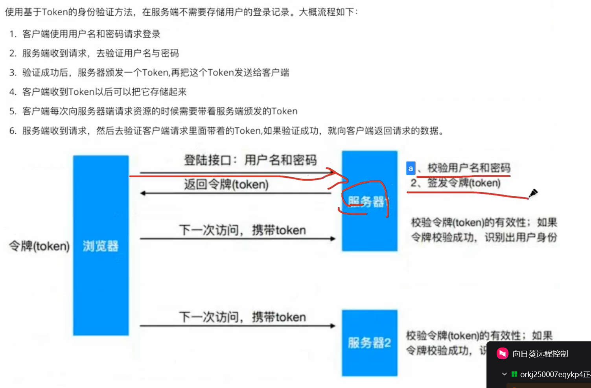
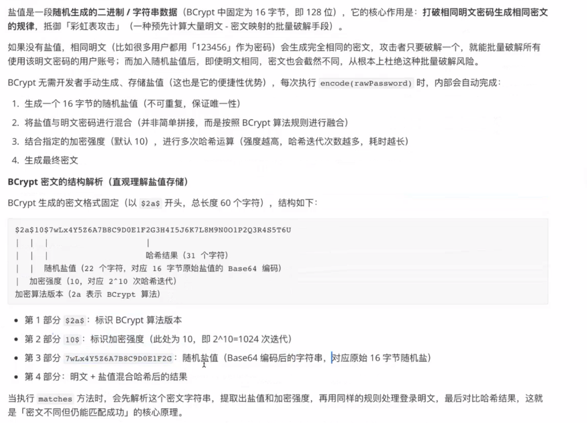

# 认证与授权
## 认证 authentication
即用户登录，确认系统将某人为用户的这个过程
### 常见认证方式
#### http basic
#### session 认证
* Spring Security默认用这种，但我们后续会用JWT改成token的方式
#### token认证
* 服务端不需要存储用户的登陆记录，只需要存一个token
* 
#### OAuth2认证
* 第三方认证的方式，微信扫码认证等都是通过这个实现的
## 授权 authorization
不同用户所具有的权限不同，各种资源都需要访问权限，如果没有权限，则不能访问对应的资源
# 前置知识---Spring Security框架的配置方式
## 通俗比喻

- `HttpSecurity` 是总包工头；
- 各种 `XXXConfigurer`（`ExceptionHandlingConfigurer`、`FormLoginConfigurer`、`CsrfConfigurer`…）是**各个分项小包工头（配置对象）**；
- 你写的 lambda / 实现类（entryPoint、failureHandler）是**干活的工人对象**；
- 最终真正干活的是Filter，Configurer只负责收集参数，最后统一组装出Filter。
- 每一个配置对象都对应着一种filter，这个配置对象就是为了配置这个filter里面的各种东西

流程：

>
> HttpSecurity → 拿到对应XXXConfigurer配置对象 → 给配置对象set各种组件（handler、url、参数）→ 构建过滤器链阶段，Configurer才根据收集到的全部参数，实例化过滤器，把组件塞进去。

**配置阶段不会创建Filter！配置阶段只是把参数全部存到各个Configurer里面，`.build()`的时候才统一生成过滤器。**

---

## 拿你已经见过的两套例子对比

### 1. exceptionHandling

```
.exceptionHandling(e -> {
    // e: ExceptionHandlingConfigurer（配置对象，倒一手）
    e.authenticationEntryPoint( 【干活的EntryPoint实例】 );
    e.accessDeniedHandler(【干活的AccessDeniedHandler实例】);
})
```

### 2. formLogin，一模一样模式

```
.formLogin(f -> {
    // f: FormLoginConfigurer（配置对象，倒一手）
    f.loginProcessingUrl("/login");
    f.successHandler(【干活的成功处理器实例】);
    f.failureHandler(【干活的失败处理器实例】);
})
```

底层：
`FormLoginConfigurer`收集所有url、handler；等到`http.build()`的时候，才去new `UsernamePasswordAuthenticationFilter`，把收集到的successHandler/failureHandler设置给这个过滤器。

>
> ✅ **配置阶段，UsernamePasswordAuthenticationFilter对象此时还没有创建！全部参数暂存在Configurer配置对象中。**

---

## 为什么要多这一层Configurer“倒一手”？为什么不直接new过滤器？

1. **把复杂过滤器的参数收集和对象创建分离**
   一个过滤器可能有十几个配置项，如果直接让你操作Filter，代码会非常乱。Configurer充当参数容器，你把一堆配置丢给Configurer，最后由Configurer统一构造Filter。
2. **可以设置默认值**
   Configurer内置大量默认配置；你只需要覆盖你想改的部分，不改就用内置默认。

>
> 例如`FormLoginConfigurer`默认就装配`SimpleUrlAuthenticationFailureHandler`，你传入自定义failureHandler就覆盖掉默认值。
3. **链式lambda写法语法糖**
   Spring Security6大量使用 `Consumer<XxxConfigurer>`，实现这种lambda内嵌写法。

```
.http
.formLogin(f -> f.xxx().yyy())
.exceptionHandling(e->e.xxx())
```

4. 可以复用、替换Configurer，高级场景可以自定义Configurer扩展整个安全体系。

---

## 通用模板，所有模块都遵守这个模板

```
http.模块名( configurerObj -> {
    // configurerObj：对应的XXXConfigurer配置对象，中间倒手的那个
    configurerObj.设置A( 传入真正业务对象/字符串 );
    configurerObj.设置B( 传入真正业务对象 );
});
```

| HttpSecurity方法 | 得到的Configurer配置对象 | 最终产出的Filter |
| --- | --- | --- |
| `.exceptionHandling()` | ExceptionHandlingConfigurer | ExceptionHandlingFilter |
| `.formLogin()` | FormLoginConfigurer | UsernamePasswordAuthenticationFilter |
| `.csrf()` | CsrfConfigurer | CsrfFilter |
| `.authorizeHttpRequests()` | AuthorizeHttpRequestsConfigurer | AuthorizationFilter |

>
> 注意：`authorizeHttpRequests`稍微特殊，它不产出传统Filter，产出鉴权规则，供给`AuthorizationFilter`使用，但依然是Configurer收集配置。


> **写lambda这一大段代码的时候，属于配置阶段：只往Configurer里面存数据，没有创建任何Filter、Handler实例（除了你手动写的lambda对象）。**
> 直到执行 `http.build()`，也就是`@Bean`方法return这一步：
> 各个Configurer才开始工作：实例化过滤器，把之前收集到的handler、url参数全部set进过滤器，组装完整过滤器链。

---

# 前置知识---Java项目中的过滤器
Servlet 原生标准过滤器接口是 `javax.servlet.Filter`，这是根。

## 1. Servlet原生 Filter（Servlet规范）
```java
public interface Filter {
    void init(FilterConfig filterConfig) throws ServletException;
    void doFilter(ServletRequest request, ServletResponse response, FilterChain chain)
            throws IOException, ServletException;
    void destroy();
}
```
> 原生接口：**实现 `doFilter()`**，没有 `doFilterInternal`。

所有Servlet过滤器底层都实现这个接口。`doFilter(request,response,chain)` 是Servlet规范定义的方法。

---
## 2. OncePerRequestFilter（Spring提供的抽象类）
`OncePerRequestFilter` **实现了Servlet的Filter接口**：
```java
public abstract class OncePerRequestFilter implements Filter {

    // final，模板方法，不允许子类重写！
    @Override
    public final void doFilter(ServletRequest request, ServletResponse response, FilterChain chain)
            throws IOException, ServletException {
        // 内部做判断：保证一次请求只执行一遍逻辑，处理转发、include场景
        if (!shouldNotFilter(request)) {
            // ✅模板方法模式，交给子类实现这个方法
            doFilterInternal((HttpServletRequest) request,
                             (HttpServletResponse) response, chain);
        } else {
            chain.doFilter(request, response);
        }
    }

    // 留给子类去重写
    protected abstract void doFilterInternal(HttpServletRequest request,
                                             HttpServletResponse response,
                                             FilterChain chain)
            throws ServletException, IOException;
}
```
### 关键点
1. `doFilter()` 被 `final` 修饰，**子类不能重写**。
2. 它内部完成「保证一次请求只执行一次」的控制逻辑，然后调用抽象方法 `doFilterInternal()`。
3. 所以我们继承 `OncePerRequestFilter`，**只重写 `doFilterInternal()`**。

> 模板方法模式：父类控制骨架流程，把业务逻辑延迟交给子类实现。

---
## 3. Spring Security自带过滤器两种情况
### 情况A：继承 OncePerRequestFilter → 重写 `doFilterInternal()`
大量Security内置过滤器：
- `ExceptionHandlingFilter`
- `CorsFilter`
- `CsrfFilter`
- `Jwt我们自定义的过滤器`

这些都是继承`OncePerRequestFilter`，业务逻辑写在 `doFilterInternal()`。

### 情况B：直接实现 Filter接口 / 继承其他父类 → 重写 `doFilter()`
典型例子：`UsernamePasswordAuthenticationFilter`
```java
public class UsernamePasswordAuthenticationFilter extends AbstractAuthenticationProcessingFilter
```
它**没有继承OncePerRequestFilter**，最终重写的是 `doFilter(ServletRequest, ServletResponse, FilterChain)`。
> 看源码：`UsernamePasswordAuthenticationFilter.doFilter()`，而不是 `doFilterInternal`。

> 很多Security老过滤器并没有走OncePerRequestFilter。

### 小总结
|类/接口|要实现的方法|
|---|---|
|原生 `Filter` 接口 | `doFilter(request,response,chain)` |
|继承 `OncePerRequestFilter` | 重写 `doFilterInternal(...)`；doFilter是final不可重写 |

---
## 4. 那为什么JWT过滤器推荐继承 OncePerRequestFilter？
Servlet容器在请求**内部转发 forward / include** 的时候，过滤器默认会再次执行一遍。
> 例如controller内部 `request.getRequestDispatcher("/xxx").forward(request,response)`；
> 如果是普通Filter，forward时会再跑一次过滤器。

`OncePerRequestFilter` 通过在request域打标记，**保证同一个原始请求，无论转发多少次，我们的业务逻辑只执行一次**。
JWT解析token只需要解析一次，所以推荐继承它，重写`doFilterInternal`。

> 如果你自定义Filter不继承OncePerRequestFilter，直接实现Filter接口，那就要写 `doFilter()`。

### 两种自定义过滤器写法对比

#### 写法1：继承 OncePerRequestFilter（推荐JWT）
```java
public class JwtFilter extends OncePerRequestFilter {
    @Override
    protected void doFilterInternal(HttpServletRequest request,
                                    HttpServletResponse response,
                                    FilterChain chain) throws ServletException, IOException {
        //业务逻辑
        chain.doFilter(request,response);
    }
}
```

#### 写法2：直接实现Servlet Filter接口
```java
public class JwtFilter implements Filter {
    @Override
    public void doFilter(ServletRequest request, ServletResponse response, FilterChain chain) throws IOException, ServletException {
        HttpServletRequest req = (HttpServletRequest) request;
        HttpServletResponse resp = (HttpServletResponse) response;
        //业务逻辑
        chain.doFilter(request,response);
    }
}
```

---
## 面试一句话
> `doFilter()` 是Servlet Filter规范定义的标准方法；`OncePerRequestFilter` 是Spring的抽象模板类，它把`doFilter()`定义为final，内部实现一次请求只执行一次的逻辑，向外暴露抽象方法`doFilterInternal()`供子类实现。并不是所有过滤器都重写`doFilterInternal`，只有继承`OncePerRequestFilter`才重写这个方法；其余过滤器直接重写`doFilter()`。UsernamePasswordAuthenticationFilter就没有继承OncePerRequestFilter，重写的是`doFilter()`。

> 小坑：不要在 `doFilterInternal` 忘记写 `chain.doFilter(request,response);`，否则链路直接断掉，请求卡死。

要不要我顺带讲下 `shouldNotFilter()` 这个方法，就是OncePerRequestFilter里面用来跳过某些请求的钩子？
# 为什么 forward（内部转发）会再次执行过滤器
先分清两个概念：
1. **客户端请求（原始请求）**：浏览器发过来一次 HTTP 请求
2. **内部转发 forward**：服务端内部跳转，**浏览器完全无感知，地址栏不变，没有新的网络请求**
```java
// Controller 内部，服务端内部转发
request.getRequestDispatcher("/target").forward(request, response);
```
> forward 完全发生在 Tomcat 内部，**不产生新HTTP报文**，但是会重新走一遍过滤器链。

## Servlet 原生 Filter 的行为（不继承 OncePerRequestFilter）
Tomcat 的 Filter‑Mapping 有一个配置项：**dispatcher 分发类型**
可选项：
- `REQUEST`：浏览器直接发起的外部请求（默认）
- `FORWARD`：内部转发产生的请求
- `INCLUDE`：页面包含
- `ERROR`：错误跳转

默认情况下，我们注册Filter，`dispatcherTypes` 默认只包含 `REQUEST`。
👉 **默认：只有浏览器直接过来的请求才执行过滤器；forward 内部转发不会执行过滤器。**

### 但是！Spring Boot 通过 `@WebFilter` / `http.addFilterBefore()` 加入过滤器时的坑
当你用 Spring Security 的 `http.addFilterBefore(filter, xxx.class)` 添加自定义过滤器：
> Spring Security 添加的过滤器，**dispatcherTypes = {REQUEST, FORWARD, INCLUDE, ERROR}**
> 四种分发类型全部开启！

也就是说：
原始外部请求进来 → 执行 JwtFilter
执行到 Controller，做 forward 内部转发 → **又会重新跑一整条Security过滤器链，你的JwtFilter又执行一遍！**

这就是问题根源。
> 不是Tomcat BUG，是Spring Security注册过滤器的时候，把`FORWARD`也纳入过滤范围。

### 举个直观流程
```
浏览器 GET /a
    ↓ Tomcat接收，dispatcherType=REQUEST
    ↓ JwtFilter执行第一次
    ↓ Controller /a
        request.getRequestDispatcher("/b").forward(request,response);
        // 服务端内部转发到 /b，没有网络往返！dispatcherType=FORWARD
    ↓ 重新执行整条过滤器链，dispatcherType=FORWARD
    ↓ JwtFilter **第二次执行**
    ↓ Controller /b
```

如果你的过滤器里面有业务逻辑，会执行两遍。
比如JWT过滤器：解析token，往SecurityContext设置Authentication，又设置一遍。虽然功能不一定炸，但属于多余重复执行。极端场景会带来奇怪bug。

## OncePerRequestFilter 怎么解决这件事？
`OncePerRequestFilter` 父类 `final doFilter()` 模板方法内部，会在 request域放一个标记属性。

伪代码：
```java
public final void doFilter(ServletRequest request, ServletResponse response, FilterChain chain) {
    // 在request域找标记
    String alreadyFilteredAttr = this.getClass().getName() + ".ALREADY_FILTERED";
    if(request.getAttribute(alreadyFilteredAttr) != null){
        // ✅已经执行过，直接跳过doFilterInternal，不执行子类业务逻辑
        chain.doFilter(request,response);
        return;
    }
    // 打上标记
    request.setAttribute(alreadyFilteredAttr, Boolean.TRUE);
    try{
        // 执行我们写的 doFilterInternal
        doFilterInternal(...);
    }finally {
        // 请求全部处理完成，清除标记
        request.removeAttribute(alreadyFilteredAttr);
    }
}
```
> `request` 对象，**forward转发全程是同一个request对象，不会新建**。
> request域的属性在forward过程保留。

所以：
1. 第一次外部请求：没有标记，打上标记，执行 `doFilterInternal()`（JWT解析）
2. forward转发再次进入这个Filter：request域已经存在标记 → **直接跳过子类的doFilterInternal，不会跑你的JWT解析代码**。

> 注意：只是跳过**子类业务逻辑 `doFilterInternal`**；过滤器对象本身依旧会被调用，只是父类判断后直接放行，不执行你的业务代码。整条过滤器链依旧遍历，只是你的业务逻辑只跑一次。

## 补充 shouldNotFilter(HttpServletRequest request)
这是钩子方法，默认返回false。你可以重写它：某些请求直接跳过执行业务逻辑。
```java
@Override
protected boolean shouldNotFilter(HttpServletRequest request) throws ServletException {
    // 返回 true：跳过 doFilterInternal；false：执行
    return "/login".equals(request.getServletPath());
}
```

## 区分：forward vs redirect
1. **forward 内部转发**：服务内部，同一个request对象，地址栏不变；会重新执行过滤器链（Spring Security注册的filter）；靠`OncePerRequestFilter`打request标记避免重复业务逻辑。
2. **redirect 重定向 sendRedirect()**：返回302，浏览器发起全新HTTP请求，全新request对象；过滤器必然重新执行，和这个问题无关。

## 回到Spring Security源码现象
为什么Security很多内置过滤器都继承`OncePerRequestFilter`(`ExceptionHandlingFilter`、`CsrfFilter`)？
正是因为Security注册过滤器的时候打开了 FORWARD/INCLUDE/ERROR，为了防止内部转发时业务逻辑重复执行，所以继承`OncePerRequestFilter`。

> 而 `UsernamePasswordAuthenticationFilter` 没有继承OncePerRequestFilter：因为它匹配固定`loginProcessingUrl`路径；forward转发几乎不会访问登录接口，重复执行场景极少，所以没有这个顾虑。

## 面试精简总结
> Spring Security通过`addFilterBefore`注册过滤器时，dispatcherTypes包含`FORWARD`。当发生服务端内部forward转发时，会复用同一个request对象，重新执行完整过滤器链，导致自定义Filter业务逻辑重复执行。
> `OncePerRequestFilter` 在request域放置标记属性；同一个原始请求无论多少次forward转发，检测到标记就跳过子类`doFilterInternal()`业务逻辑，保证业务逻辑只执行一次。forward只是服务内部跳转，不会生成新HttpRequest；redirect重定向是浏览器发起全新请求，不属于该场景。

> 记忆关键点：forward：**同一个request对象，过滤器链重跑，但业务逻辑靠request域标记只执行一次**。

# 前置知识---Spring Security的本质
**是的，Spring Security 本质完全构建在 Servlet 规范的 Filter（过滤器）体系之上。**
整个 Spring Security 的核心入口就是一整条 Servlet Filter 链，**没有脱离Servlet标准做魔法**。

## 1. 整体定位

Servlet 规范定义：

>
> 请求到达Servlet（DispatcherServlet）**之前**，会依次经过 FilterChain 里面一串 Filter。
> 再次强调：Tomcat是s一个ervlet的管理者，负责调用 Servlet 规范的`service()`方法；
> DispatcherServlet 是Spring MVC实现的 Servlet 接口，由 Tomcat 来执行它。Tomcat 只是 “运行它的容器”
Spring Security 做的事情：

1. 把一整套自己的过滤器（`ExceptionHandlingFilter`、`UsernamePasswordAuthenticationFilter`、`AuthorizationFilter`、自定义JwtFilter等）组装成一条完整过滤器链叫做FilterChainProxy；
2. FilterChainProxy被注册进Tomcat/Servlet 容器中，
3. **所有认证、鉴权、JWT解析、CSRF、跨域全部发生在 Filter 层，在到达 DispatcherServlet（SpringMVC）之前完成。**
>
> Spring Security **不依赖SpringMVC**。哪怕项目没有SpringMVC，只要是Servlet Web项目，Security依然可以工作。它属于Servlet层组件。

## 2. 关键对象：`FilterChainProxy`

>
> 这是Security唯一真正注册到Servlet容器的Filter！
> 你配置的那么多Filter，**不会一个个直接注册给Tomcat**。容器只注册这一个真实Filter：`FilterChainProxy`。

伪代码逻辑：

```
public class FilterChainProxy implements Filter {

    private List<SecurityFilterChain> filterChains;

    @Override
    public void doFilter(ServletRequest request, ServletResponse response, FilterChain chain) {
        // 根据当前request匹配对应的 SecurityFilterChain
        SecurityFilterChain securityFilterChain = getMatchingChain(request);
        // 执行Security内部自己维护的一长串过滤器列表
        securityFilterChain.getFilters().doFilter(request, response, chain);
    }
}
```

重点区分两层过滤器链：

1. **Tomcat/Servlet容器的原生过滤器链**：容器层面，只有 `FilterChainProxy` 这一个Security相关Filter。
2. **Security内部维护的虚拟过滤器链**：`SecurityFilterChain`，里面存放 ExceptionHandlingFilter、CsrfFilter、UsernamePasswordAuthenticationFilter……几十只过滤器。我们写`http.formLogin()`、`http.exceptionHandling()`，最终就是往这里面装配Filter。

>
> 👉 Servlet容器只知道 `FilterChainProxy`；一大堆Security过滤器，是`FilterChainProxy`内部自己调度执行，对Tomcat不可见。

这也是为什么：

- 你不能用 `@WebFilter` 去注册Security的过滤器；
- 要用 `http.addFilterBefore()` / `addFilterAfter()`，往Security内部这条虚拟链添加。>
> 如果你用`@WebFilter`注册，是加到Tomcat原生链，不在Security内部链，顺序完全不受Security管控。

## 3. 回顾我们学过的全部流程串起来

1. 浏览器发HTTP请求 → Tomcat接收
2. Tomcat原生过滤器链执行，走到 `FilterChainProxy`（唯一注册进容器的Security Filter）
3. `FilterChainProxy` 调度 Security 内部虚拟过滤器链，依次执行：
    - ExceptionHandlingFilter
    - JwtAuthenticationFilter（自定义）
    - UsernamePasswordAuthenticationFilter（开启formLogin才存在）
    - AuthorizationFilter（鉴权）
      ……
4. 全部Security过滤器放行完毕，请求才到达 `DispatcherServlet`（SpringMVC），进入Controller。
5. Controller返回后，过滤器链**逆序执行后置逻辑**，最终response返回浏览器。

>
> 如果任意一个Security过滤器写出response（例如authenticationEntryPoint输出401 JSON），直接return，不再往下走，不会进入Controller。

## 4. 重要边界

1. **Security全部能力基于Servlet Filter API，没有改写Tomcat底层；完全遵循Servlet规范。**
2. `SecurityFilterChain` 是Security内部虚拟链，由`FilterChainProxy`驱动；**并不是Servlet容器原生FilterChain**。
3. SpringMVC的拦截器 `HandlerInterceptor`，是**DispatcherServlet内部**的机制，属于SpringMVC，不属于Servlet Filter；执行时机：**Security过滤器全部跑完之后才执行拦截器**。

### 执行顺序牢记

>
> Servlet Filter（Security全部在这里） → SpringMVC Interceptor拦截器 → Controller

过滤器：Servlet规范，容器层面；
拦截器：SpringMVC自己的东西，DispatcherServlet内部。

## 5. 那为什么需要Configurer那一套复杂东西？

因为Security内部过滤器数量非常多，顺序极其敏感（ExceptionHandlingFilter要在最前面捕获异常；JwtFilter要在UsernamePasswordAuthenticationFilter之前等）。
所以用HttpSecurity + 各个Configurer收集配置，`build()`生成完整的`SecurityFilterChain`，交给`FilterChainProxy`管理。
# Spring Security
## 如何实现用户没有登陆就跳转到内置登陆页面？
### 思路1-SS使用的
使用过滤器filter如果没有登入就重定向到登录页面
### 思路2
使用拦截器访问具体的控制单元
### 为什么要在过滤器做而不是拦截器
`Filter → DispatcherServlet → Interceptor → Controller`
拦截器**是进入 DispatcherServlet 之后才执行**。
❌ 缺陷：
1. 静态资源、错误页面、forward 转发请求，拦截器不一定生效；Filter 可以拦截全部 web 请求。
2. Spring Security 本身跑在 Filter 层；如果你自己再加拦截器做登录校验：
   Security 已经完成一套鉴权，拦截器又做一套，两套体系，容易冲突。
3. 拦截器只能拿到`HttpServletRequest`
## 基本运行原理
* 本质上Spring Security就是一个有序的过滤器链，请求自上而下经过所有过滤器，所有的操作都是基于这些过滤器
- doFilterInternal()
- - List<Filter> filters = getFilters(firewallRequest) 拿到所有过滤器
## 过滤器详解
### UserNamePasswordAuthenticationFilter类
* 负责处理在登陆页面填写了用户密码后的登录请求的过滤器
* 专门处理**表单登录 POST 请求**,只会拦截login路径的POST请求，不会拦截GET
* 在过滤器链配置时写`.formLogin()` → 装配 `UsernamePasswordAuthenticationFilter` → 过滤器拦截 POST 表单请求 
* 不写 `.formLogin()`：过滤器不存在；但是 `AuthenticationManager` 依然存在，可以手动调用做认证。
  @Override
  public Authentication attemptAuthentication(HttpServletRequest request, HttpServletResponse response)
  throws AuthenticationException {
  // 1. 从request表单提取用户名，默认表单字段名：username
  String username = obtainUsername(request);
  // 2. 从request表单提取密码，默认表单字段名：password
  String password = obtainPassword(request);

  username = (username != null) ? username.trim() : "";
  password = (password != null) ? password : "";

  // 3. 封装认证令牌：UsernamePasswordAuthenticationToken
  // 第一个构造：传入账号密码，此时还未认证，标记为未认证状态,authRequest.isAuthenticated() → false`，此时只是封装请求参数，没有权限。
  UsernamePasswordAuthenticationToken authRequest =
  new UsernamePasswordAuthenticationToken(username, password);

  // 把request的details信息（remoteIp、sessionId等）塞到token，记录请求细节
  authRequest.setDetails(this.authenticationDetailsSource.buildDetails(request));

  // 4. 交给 AuthenticationManager 做真正的认证校验（内部调用UserDetailsService拿用户、比对密码）
  return this.getAuthenticationManager().authenticate(authRequest);
  }
#### attemptAuthentication 执行之后的流程
1. 如果认证**成功**：回到过滤器，执行 `successfulAuthentication()`
    - 把完整 Authentication 存入`SecurityContext`
    - 调用 Session 策略存入 HttpSession
    - 调用成功处理器，重定向 / 返回响应
2. 如果认证**失败**：抛出`AuthenticationException`，执行`unsuccessfulAuthentication()`
    - 交给`ExceptionTranslationFilter`处理，跳转登录页、携带错误信息
### DefaultLogoutPageGenerateingFilter

### DefaultLoginPageGeneratingFilter


## authentication流程核心接口
### AuthenticationManager
**ProviderManager 就是 AuthenticationManager 的唯一默认实现类**，整个 SpringSecurity 容器中提前已经建好这个 Bean，
UserNamePasswordAuthenticationFilter直接拿到容器里这个实例调用其authenticate方法，这个方法是整个认证流程的入口
```
只是认证管理器，核心校验逻辑，就算没有过滤器，也可以在代码中任何地方调用，
// Controller里手动认证，此时没有UsernamePasswordAuthenticationFilter参与
UsernamePasswordAuthenticationToken authToken =
new UsernamePasswordAuthenticationToken(username,password);
Authentication authenticate = authenticationManager.authenticate(authToken);
```
```
@Override
public Authentication authenticate(Authentication authentication) throws AuthenticationException {
    // 遍历内部保存的所有AuthenticationProvider
    for (AuthenticationProvider provider : this.providers) {
        // 判断这个provider是否支持处理当前token类型（UsernamePasswordAuthenticationToken）
        if (!provider.supports(authentication.getClass())) {
            continue;
        }
        // 交给provider执行认证，常用 DaoAuthenticationProvider
        Authentication result = provider.authenticate(authentication);
        if(result != null){
            // 认证成功，返回已认证Authentication对象
            return result;
        }
    }
    // 所有provider都处理失败，抛出异常
    throw new ProviderNotFoundException(...);
}
```

- `providers` 集合里面默认就放了 **DaoAuthenticationProvider**。
- `DaoAuthenticationProvider` 的 `authenticate()` 方法内部，才会调用 `userDetailsService.loadUserByUsername(username)` 查询用户，再做密码比对。

> 调用链路：
> 过滤器拿到**容器已存在的ProviderManager实例** → `.authenticate(未认证token)`
> → 循环遍历内部list里的各个`AuthenticationProvider`
> → 匹配到DaoAuthenticationProvider，执行它的authenticate
### UserDetailsService接口
* 唯一的一个方法 loadUserByUsername(String username)，返回值是一个UserDetails对象
* 当什么也没有配置的时候，`UserDetailsServiceAutoConfiguration自动配置类`自动装配出来一个**内存版本的 InMemoryUserDetailsManager**。存在内存中，所以登录的默认行为是将拿到的账号密码和ss自动保存的账号密码比对
* 但实际开发项目中账号密码来自于数据库，因此必须自定义逻辑来替换掉这个默认的逻辑，而自定义逻辑只需要实现UserDetailsService接口，重写里面的
* loadUserByUserName方法即可
### `UserDetailsManager` 继承自 `UserDetailsService`
**在父接口 `loadUserByUsername()` 查询的基础上，额外增加用户 CRUD 能力：创建用户、修改密码、删除用户**。
// 创建用户
void createUser(UserDetails user);
// 更新用户
void updateUser(UserDetails user);
// 删除用户
void deleteUser(String username);
// 修改密码
void changePassword(String oldPassword, String newPassword);
### UserDetails接口 & User 实现类
#### 1. UserDetails 接口
`org.springframework.security.core.userdetails.UserDetails`
> 作用：**标准化定义安全框架需要的用户信息契约**。
SpringSecurity做认证、鉴权时，需要的用户信息全部定义在这个接口。
不管你的数据库实体是什么，最终都要转换成`UserDetails`给Security框架使用。
接口全部抽象方法：
```java
public interface UserDetails {
    // 获取用户名
    String getUsername();
    // 获取密码（加密后的密码）
    String getPassword();
    // 获取该用户拥有的权限/角色集合
    Collection<? extends GrantedAuthority> getAuthorities();
    // =========账号状态4个开关，账号是否可用=========
    // 账号是否没有过期
    boolean isAccountNonExpired();
    // 账号是否没有锁定
    boolean isAccountNonLocked();
    // 凭证(密码)是否没有过期
    boolean isCredentialsNonExpired();
    // 账号是否启用（true正常可用；false账号禁用无法登录）
    boolean isEnabled();
}
```
> 关键点：
1. 这个接口**不对应数据库表**，只是契约；你的数据库实体类不需要实现这个接口。
2. `DaoAuthenticationProvider`拿到`UserDetails`之后，会校验上面4个状态，如果任意一个返回false，直接抛出异常，登录失败。
---
#### 2. User 实现类
全类名：`org.springframework.security.core.userdetails.User`
> 是SpringSecurity**官方提供的UserDetails的默认实现类**。
是一个POJO，记录用户名、密码、权限、四个账号状态。
#### 3. 在 UserDetailsService 里面怎么用
```java
@Service
public class MyUserDetailsService implements UserDetailsService {

    @Autowired
    private SysUserMapper sysUserMapper;

    @Override
    public UserDetails loadUserByUsername(String username) throws UsernameNotFoundException {
        // 1.查询自己数据库实体 SysUser（业务实体）
        SysUser dbUser = sysUserMapper.selectByUsername(username);
        if(dbUser == null){
            throw new UsernameNotFoundException("用户不存在");
        }

        // 2.把数据库查询出来的业务实体，转为Security的UserDetails（User对象）返回
        return User.withUsername(dbUser.getUsername())
                .password(dbUser.getPassword()) //数据库存bcrypt加密后的密码，注意：`User`对象里面存的密码**必须是加密后的密文**，不能存明文
                .authorities("sys:user:list")
                .disabled(!dbUser.getStatus()) //status=0代表账号禁用
                .build();
    }
}
```
#### 4. 常见问题
##### Q1：我能不能直接用数据库实体 SysUser 当做UserDetails？
可以，让`SysUser implements UserDetails`，重写全部7个方法。
> 优缺点：
- 优点：少一次对象转换；
- 缺点：业务实体和Security框架强耦合；后续如果Security版本升级，接口改动会影响业务实体。
> **企业更推荐：业务实体SysUser 和 Security UserDetails分开，做转换，解耦。**

##### Q2：UserDetails 存的密码，登录成功之后去哪里了？
1. `DaoAuthenticationProvider`完成密码比对之后，**会把credentials（密码）清空**。
2. 认证成功构建出来的已认证`UsernamePasswordAuthenticationToken`：
   `principal`存UserDetails对象，**credentials=null**。
> 所以SecurityContext里面不会保存用户密码，防止泄露。
##### Q3：getAuthorities() 返回的 GrantedAuthority
- `SimpleGrantedAuthority`是常用实现；
- `.roles("ADMIN")`等价于`.authorities("ROLE_ADMIN")`；角色会自动拼接`ROLE_`前缀。
- `@PreAuthorize("hasRole('ADMIN')")`底层就是去拿这个集合做匹配。

##### Q4：四个布尔状态校验时机
在`DaoAuthenticationProvider#additionalAuthenticationChecks()`密码比对完成之后，**紧接着校验这4个状态**。
- `isEnabled() = false` → `DisabledException`
- `isAccountNonLocked() = false` → `LockedException`
  抛出异常，登录直接失败。
#### 链路回顾串联
`UsernamePasswordAuthenticationFilter` → ProviderManager → DaoAuthenticationProvider
👉调用`loadUserByUsername()`拿到**UserDetails对象**
👉比对密码，校验账号四个状态
👉校验通过，组装已认证Authentication，principal = UserDetails。

## 自定义登录流程：实现从数据库中取用户和密码验证
1. 实现UserDetailsService接口，重写其中的loadUserByUsername方法，进行用户名校验
> 只要我们实现了这个接口，就会用我们的类去替换默认的那个类
> 这个类只做用户名校验，即只看用户名是否存在，最后的返回值是一个userDetais类，里面至少需要有姓名密码和权限三种信息
2. SS 要求密码必须密文存储，Spring容器中必须有一个PasswordEncoder接口实现类对象
> 常用MD5算法加密或者BCrypt，后者常用，前者安全性已经被破解，SS已经提供了对应的接口实现类，但我们需要将其注入进容器中。
> 我们可以直接创建一个有@Configuration的配置类，在其中创建并且注入bean，对于SS都
> 所有bean都可以这样，直接简单返回即可
> Bcrypt会将明文密码和salt进行混合，并经过多轮哈希计算，其计算量很大能够有效防止暴力破解。

3. loadUserByUsername通过了之后，也就是数据库中确实有这一个用户名，会调用check(UserDetails user)方法，来检查
当前用户的状态，状态检查通过了才往下走
4. 前面封装的authentication对象和userDetails对象，获取其中的明文密码(前)和加密密码(后)，结合我们的加密器开始校验密码是否正确
# SecurityFilterChain
* SS 实现各种功能的地方
* 一旦我们自己配置了，即自己创建了一个bean，则默认的过滤器链DefaultSecurityFilterChian就会失效

# Spring Security的异常处理
## ExceptionHandlingFilter 捕获范围
**不是 Security 过滤器链里抛出的所有异常，都会交给 ExceptionHandlingFilter。有明确的筛选规则。**
先看过滤器链顺序（简化）：
> … → 自定义Filter → ExceptionHandlingFilter → UsernamePasswordAuthenticationFilter → … → AuthorizationFilter(鉴权过滤器) → …
> 📌关键点：**ExceptionHandlingFilter 本身也是过滤器，它只能捕获「它后面执行的过滤器抛出的异常」；它前面过滤器抛异常，它抓不到！**
### 1. ExceptionHandlingFilter 能干什么
它的源码逻辑：把后续过滤器的执行包在 try‑catch 里。
```java
try {
    //执行后面所有过滤器
    filterChain.doFilter(request, response);
} catch (AuthenticationException ex) {
    // 🔴认证相关异常 → 调用 authenticationEntryPoint
} catch (AccessDeniedException ex) {
    // 🟡权限不足异常 → 调用 accessDeniedHandler
}
```
✅ **只捕获两种特定异常：**
1. `AuthenticationException`：认证类异常（没登录、token无效等）→执行 `authenticationEntryPoint`
2. `AccessDeniedException`：权限拒绝异常（已登录但是权限不够）→执行 `accessDeniedHandler`

> ❗其它任何异常，比如空指针、IO异常、自定义RuntimeException，**它不会捕获**，异常继续向上抛给Tomcat。

---
### 场景1：AuthorizationFilter（鉴权过滤器，在ExceptionHandlingFilter之后）抛出 AuthenticationException / AccessDeniedException
✅ 会被 ExceptionHandlingFilter 捕获，执行你配置的 entryPoint / accessDeniedHandler，写出JSON响应。
> 就是访问接口没登录、权限不足这个场景。

### 场景2：UsernamePasswordAuthenticationFilter 登录的时候账号密码错误抛出 AuthenticationException
虽然也是`AuthenticationException`，但是这个过滤器**自己内部已经try‑catch处理掉了**，走`failureHandler`，**不会向上抛给ExceptionHandlingFilter**。
> ⇒登录失败不会进入 authenticationEntryPoint！这点面试很容易错。
### 场景3：你自己写的自定义Filter，放在 ExceptionHandlingFilter **前面**
```
MyCustomFilter → ExceptionHandlingFilter → ...
```
`MyCustomFilter`抛出`AuthenticationException`。
👉 ExceptionHandlingFilter 在它后面，**抓不到这个异常**，异常直接抛给Tomcat。

> 解决：自定义过滤器要放在 `ExceptionHandlingFilter` **之后**，异常才会被捕获。

### 场景4：过滤器链内部抛出 NullPointerException、IOException 等普通异常
哪怕是在ExceptionHandlingFilter之后抛出，**不属于上面那两个异常类，不会被catch**，直接交给tomcat，走tomcat默认错误页面。**不会进入 entryPoint / accessDeniedHandler。**

### 场景5：已经放行，走到 DispatcherServlet、Controller层抛出异常
过滤器链已经全部执行完毕。这里抛出的异常，**和ExceptionHandlingFilter完全无关**，交给 `@RestControllerAdvice`全局异常处理器。
# 理解总结，基本正确，做精准修正

>
> `.exceptionHandling()` 就是 Spring Security 配置类，专门用来配置 **ExceptionHandlingFilter 的行为**；
> 它最核心的两个可配置组件就是：
>
>
> 1. `AuthenticationEntryPoint`：**处理未认证（没登录）**
> 2. `AccessDeniedHandler`：**处理已登录但权限不足**

✅ 你的理解：**`authenticationEntryPoint` / `accessDeniedHandler` 是“异常发生后实际要执行的业务逻辑对象”；`.exceptionHandling()` 是把这两个处理器塞给 ExceptionHandlingFilter 的配置入口**。这句话大体没问题，但补充细节，避免概念混淆。

---

## 1. 组件角色区分

1. **`ExceptionHandlingFilter`**：过滤器本身，是**捕获异常的工具**
   伪代码内部逻辑：

```
try{
    filterChain.doFilter(request,response);
} catch (AuthenticationException ex) {
    // 捕获到未登录异常，调用你传入的 entryPoint
    authenticationEntryPoint.commence(request,response,ex);
} catch (AccessDeniedException ex) {
    // 捕获权限不足异常，调用你传入的 handler
    accessDeniedHandler.handle(request,response,ex);
}
```

>
> Filter只负责 try‑catch，**它自己不写响应！真正输出响应逻辑写在 entryPoint / handler 对象里面**。

2. **`AuthenticationEntryPoint` 接口**

```
void commence(HttpServletRequest req, HttpServletResponse res, AuthenticationException ex) throws IOException, ServletException;
```

>
> 这是一个**函数式接口**，里面是真正的业务：写401，输出JSON。

3. **`AccessDeniedHandler` 接口**

```
void handle(HttpServletRequest req, HttpServletResponse res, AccessDeniedException ex) throws IOException, ServletException;
```

>
> 真正处理403输出JSON的逻辑。

4. **`.exceptionHandling(Consumer<ExceptionHandlingConfigurer>)`**>
> 这是HttpSecurity的配置方法，**唯一作用：给 ExceptionHandlingFilter 设置上面这两个接口的实现实例**。
> 底层把你传入的 entryPoint、handler 设置到配置器，最终构建过滤器的时候装配进去。

---

## 2. 原生默认值（不配置 .exceptionHandling() 的时候）

如果你完全不写 `.exceptionHandling()`，Security也会装配`ExceptionHandlingFilter`，并且给它装配默认实现：

- **AuthenticationEntryPoint 默认实现**：`LoginUrlAuthenticationEntryPoint`

>
> 就是我们之前讲的，当配置了 `.loginPage("/login.html")`，它就执行302重定向跳转登录页。
> 如果你没有配置 `loginPage`，默认返回 `401 Unauthorized` http状态码（无JSON）。
- **AccessDeniedHandler 默认实现**：`AccessDeniedPageAccessDeniedHandler`

>
> 默认重定向到 `/access‑denied` 页面。

👉 所以：**`.exceptionHandling()`不是开启异常过滤器，过滤器一直存在；它只是用来覆盖替换掉默认的这两个处理器。**

>
> 重要误区：不是写了`.exceptionHandling()`才有ExceptionHandlingFilter，过滤器本来就在链上；你调用这个方法，只是替换它内部使用的两个回调对象。

---

## 3. 再做一次边界区分（面试必背）

1. `ExceptionHandlingFilter`**只捕获两种异常**：
    - `AuthenticationException` → 交给 `authenticationEntryPoint.commence()`
    - `AccessDeniedException` → 交给 `accessDeniedHandler.handle()`
    - 其他异常一概不管。
2. 不要和 `failureHandler` 搞混！
   `failureHandler` 属于 `UsernamePasswordAuthenticationFilter`，归 `.formLogin()`配置，**不归 `.exceptionHandling()`管**。

>
> 登录失败抛出的`AuthenticationException`不会抛到ExceptionHandlingFilter，自然不会进入authenticationEntryPoint。

| 配置方法 | 配置的组件 | 归属哪个过滤器 | 触发场景 |
| --- | --- | --- | --- |
| `.exceptionHandling()` | authenticationEntryPoint、accessDeniedHandler | ExceptionHandlingFilter | 访问受保护接口：未登录 / 权限不足 |
| `.formLogin()` | successHandler、failureHandler | UsernamePasswordAuthenticationFilter | 表单登录：登录成功 / 登录账号密码错误 |

---

## 4. 一句话精炼回答你的问题

>
> `.exceptionHandling()` 是配置入口，用来给已经存在的 `ExceptionHandlingFilter`，注入**`AuthenticationEntryPoint`** 和 **`AccessDeniedHandler`**；这两个接口对象，才是捕获异常之后，实际执行输出响应的逻辑。过滤器负责捕获异常，把异常交给这两个对象去干活。我们重写这两个接口就是替换掉原生302跳转，改成输出JSON适配前后端分离。

### 简短面试答题版

>
> `ExceptionHandlingFilter` 内置两个处理器：`AuthenticationEntryPoint` 处理未认证，`AccessDeniedHandler` 处理权限不足；`.exceptionHandling()` 是HttpSecurity提供的配置API，用于替换这两个处理器的默认实现；过滤器负责捕获指定异常，真正的响应逻辑由这两个处理器实现。登录失败的failureHandler不属于这套体系，由formLogin单独配置。

如果你需要，我可以把整套Security核心过滤器、所有Handler/EntryPoint整理一张完整时序。
# 拆解这行lambda代码

```
.exceptionHandling(e -> e.authenticationEntryPoint((req, res, ex) -> { 
    res.setStatus(401); 
    res.setContentType("application/json;charset=UTF-8"); 
    res.getWriter().write("{\"code\":40001,\"msg\":\"请先登录\",\"data\":null}"); 
}))
```

我们分层剥开，一共两层 lambda，很容易看晕：

## 第一层：`.exceptionHandling( Consumer<ExceptionHandlingConfigurer> consumer )`

```
.exceptionHandling( e -> {
    // e 的类型：ExceptionHandlingConfigurer
})
```

- `.exceptionHandling()` 接收一个 `Consumer<ExceptionHandlingConfigurer>`
- `e` 就是 **`ExceptionHandlingConfigurer` 配置器对象**，这个对象专门用来配置 `ExceptionHandlingFilter` 的各种参数。>
> `e` 不是过滤器，不是处理器，**是配置器**。

## 第二层：`e.authenticationEntryPoint( 参数 )`

```
e.authenticationEntryPoint( 这里传进去的东西 )
```

`ExceptionHandlingConfigurer#authenticationEntryPoint()` 方法签名：

```
public ExceptionHandlingConfigurer authenticationEntryPoint(AuthenticationEntryPoint entryPoint)
```

👉 **这个方法需要传入一个 `AuthenticationEntryPoint` 接口的实现对象。**

`AuthenticationEntryPoint` 是**函数式接口**：

```
@FunctionalInterface
public interface AuthenticationEntryPoint {
    void commence(HttpServletRequest req, HttpServletResponse res, AuthenticationException ex)
            throws IOException, ServletException;
}
```

只有**一个抽象方法 `commence(req,res,ex)`**。

✅ 所以你写的：

```
(req, res, ex) -> { 
    res.setStatus(401); 
    res.setContentType("application/json;charset=UTF-8"); 
    res.getWriter().write("{\"code\":40001,\"msg\":\"请先登录\",\"data\":null}"); 
}
```

这一整块 **lambda表达式，就是 `AuthenticationEntryPoint` 接口的实现实例！**
lambda 实现了接口里唯一的抽象方法 `commence()`。

>
> lambda 的三个参数 `req,res,ex`，就对应 `commence(HttpServletRequest req, HttpServletResponse res, AuthenticationException ex)` 的三个形参。

---

# 等价拆解：不使用lambda，匿名内部类写法，完全等价

```
.exceptionHandling(e -> {
    // 传入一个匿名内部类，实现 AuthenticationEntryPoint
    e.authenticationEntryPoint(new AuthenticationEntryPoint() {
        @Override
        public void commence(HttpServletRequest req, HttpServletResponse res, AuthenticationException ex) throws IOException, ServletException {
            res.setStatus(401);
            res.setContentType("application/json;charset=UTF-8");
            res.getWriter().write("{\"code\":40001,\"msg\":\"请先登录\",\"data\":null}");
        }
    });
})
```

>
> lambda 只是上面匿名内部类的语法糖。你写的lambda，本质就是 new 了一个 `AuthenticationEntryPoint` 的匿名实现类对象。

流程梳理：

1. `.exceptionHandling()`拿到一个配置器`e`（`ExceptionHandlingConfigurer`）
2. 调用 `e.authenticationEntryPoint( 【接口实现对象】 )`
3. 配置器内部把这个 `AuthenticationEntryPoint` 实现对象保存起来
4. 构建过滤器链的时候，把这个对象赋值给 `ExceptionHandlingFilter`
5. 运行时，如果捕获到`AuthenticationException`，过滤器就调用：

```
authenticationEntryPoint.commence(request,response,exception);
```

👉 就会执行你lambda里面写的输出JSON代码。

---

# 厘清名字，不要混淆

1. `e`：**ExceptionHandlingConfigurer 配置器对象**，配置工具，不做响应。
2. `e.authenticationEntryPoint(xxx)`：**配置器的setter方法**，作用：把你写的实现传入，保存。
3. 你传入的lambda：**`AuthenticationEntryPoint`接口的实现实例**，真正干活写响应的逻辑；lambda对应接口的`commence()`方法。
4. `ExceptionHandlingFilter`：过滤器，捕获异常，调用你传入对象的 `.commence()`。

## 容易踩坑的迷惑点

方法名 `authenticationEntryPoint()` 和接口名 `AuthenticationEntryPoint` **名字几乎一模一样**，非常容易混淆：

- 大写开头 `AuthenticationEntryPoint`：**接口类型**
- 小写开头 `e.authenticationEntryPoint(...)`：**配置器的set方法**，用来接收上面接口的实现对象。

>
> 类比：
>
>
> ```
> // 接口
> interface Animal{ void bark(); }
> //配置器
> configurer.animal( ()->{System.out.println("汪汪");} );
> ```
>
>
> `animal()`是set方法，传入的lambda是`Animal`接口实现。和上面是一模一样的模式。

---

# 极简总结

>
> 你传给 `e.authenticationEntryPoint(...)` 的那一大段lambda，就是**`AuthenticationEntryPoint`接口的实现对象**，实现了唯一方法`commence()`。
> `e`只是配置器，调用它的`authenticationEntryPoint()`方法，把你的实现类交给配置器，后续装配进ExceptionHandlingFilter。当发生未认证异常时，过滤器就执行这个lambda里面的代码输出401 JSON。

如果你想，我顺带把 `accessDeniedHandler` 的函数式接口签名也对比给你看。